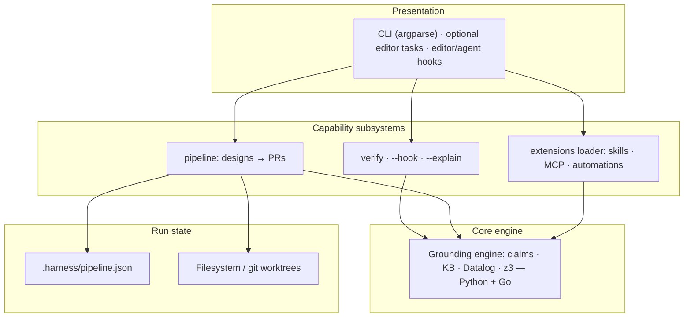
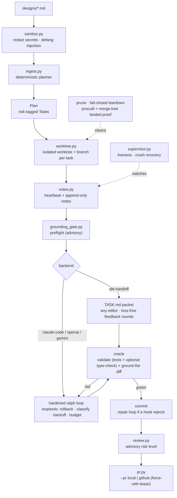
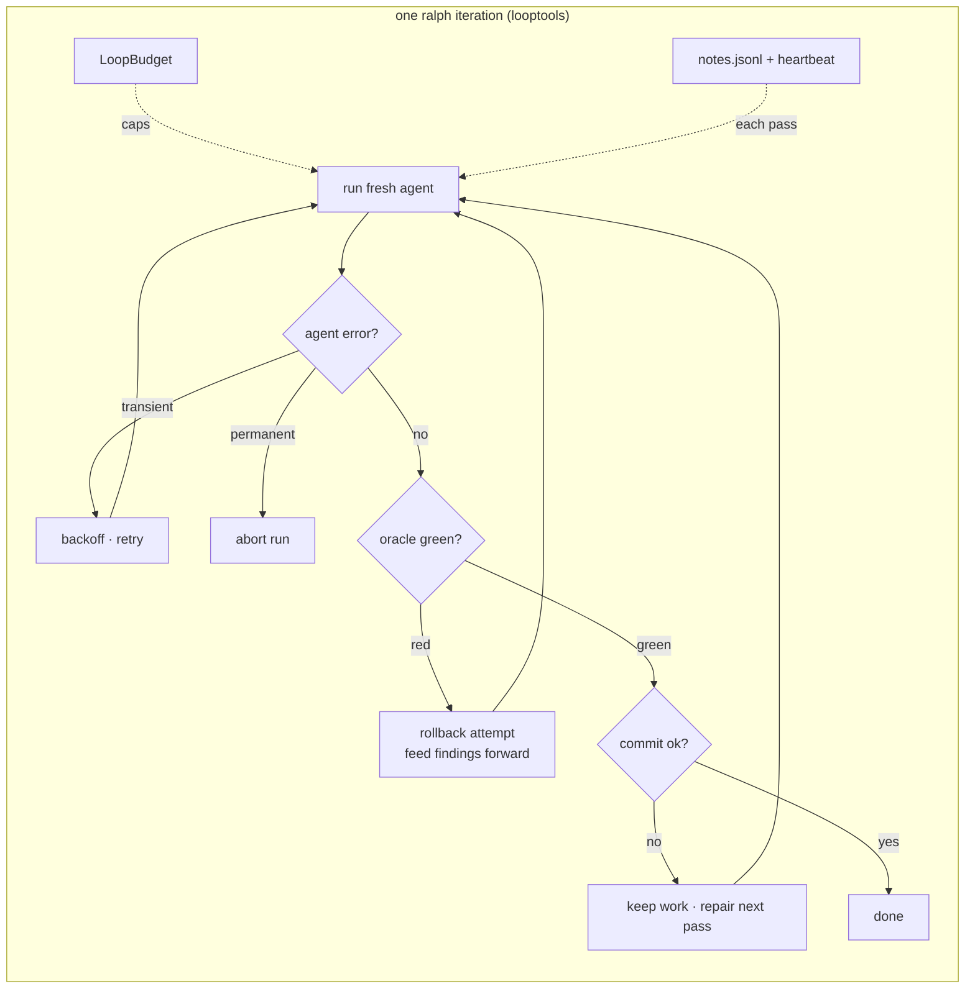
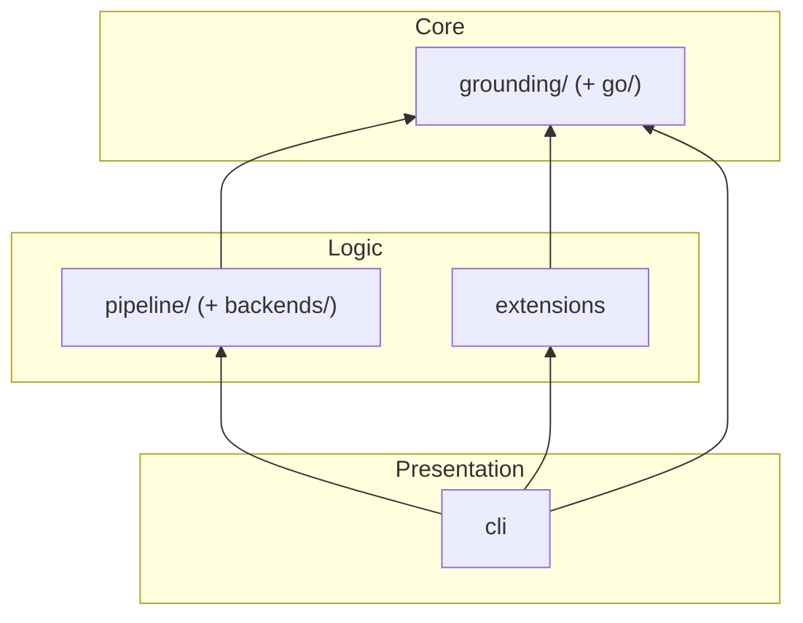

# 🏗️ System Architecture

> A deep-dive into the internal architecture of Harness — the neuro-symbolic
> **grounding gate** and the **design-docs → PRs** pipeline built on top of it.

---

## Table of Contents

- [High-Level Overview](#high-level-overview)
- [Component Breakdown](#component-breakdown)
  - [CLI Layer](#cli-layer)
  - [Pipeline Layer (design-docs → PRs)](#pipeline-layer-design-docs--prs)
- [Extension Points](#extension-points)
- [Observability](#observability)
- [Error Handling](#error-handling)
- [Thread Safety](#thread-safety)
- [Design Decisions](#design-decisions)

---

## High-Level Overview

Harness is a set of **capability subsystems** (verify, pipeline, extensions)
over one shared **core engine** — the neuro-symbolic **grounding engine**. The
`verify` gate and the design-docs → PRs pipeline both depend on grounding;
pipeline run-state lives in a repo-local JSON plan and git worktrees. Each
subsystem depends only on the core below it, keeping every component
independently testable.



---

## Component Breakdown

### CLI Layer

**Module:** `harness/cli.py`

The CLI is the sole entry point for user interaction. It uses Python's
`argparse` to define a tree of subcommands over the grounding gate, the
pipeline, and the extensions loader.

#### Responsibilities

- Parse command-line arguments into structured requests
- Dispatch to the grounding gate, the pipeline, or the extensions loader
- Format and colorise output for the terminal
- Handle keyboard interrupts and graceful shutdown
- Surface exit codes as a CI / pre-commit contract (see [Exit Codes](#exit-codes))

#### Subcommand Tree

```
harness
├── verify <file> [--lang] [--explain] [--hook]   # Grounding gate (Python/Go); --hook = editor side-car
├── pipeline                                       # Design-docs → PRs
│   ├── plan                                       #   decompose designs/*.md → risk-tagged tasks
│   ├── run [--backend] [--pr] [--parallel] [--task]
│   ├── status                                     #   show plan / task state
│   ├── complete <task-id>                         #   finish an IDE-implemented task → PR
│   ├── supervise [--recover]                      #   liveness report + crash recovery
│   ├── prune                                      #   fail-closed teardown of landed worktrees
│   ├── trace                                      #   inspect the span-trace journal
│   ├── verify-diff                                #   ground a diff / changed files
│   └── backends                                   #   list code-writing backends
├── extensions [--init]                            # List/scaffold drop-in skills / MCP servers / automations
└── status                                         # Grounding solver, backend availability, dependencies, extensions
```

#### Output Formatting

The CLI uses ANSI escape codes for rich terminal output:

| Element | Colour | Example |
|---|---|---|
| Success | Green (`\033[32m`) | ✅ Grounded |
| Warning | Yellow (`\033[33m`) | ⚠️ z3 not found — using builtin solver |
| Error | Red (`\033[31m`) | ❌ Grounding failed |
| Info | Cyan (`\033[36m`) | ℹ️ Planning designs/ |

---

### Pipeline Layer (design-docs → PRs)

**Module:** `harness/pipeline/`

A layer built *on top of* the grounding engine that turns markdown **design
documents** into **pull requests** — one per independent task. It fuses the
shell-script loop in `loopeng/` (a plan → implement → review workflow:
`ralph.sh`, `orchestrate.sh`, `review.sh` — see `loopeng/README.md` for its
provenance) with the harness's grounding gate, and exposes the whole thing
through `harness pipeline …` (plus optional editor tasks and an optional tmux
cockpit).



| Component | Responsibility |
|---|---|
| `ingest.py` | Parse `designs/*.md` → a `Plan` of independent, risk-tagged `Task`s. **Deterministic, LLM-free** — reads markdown structure (frontmatter, `## Tasks` checklist, sections), not vibes. |
| `spec.py` | `Task` / `Plan` / `PipelineConfig` data models + lifecycle (`pending → implementing → awaiting-human → review → done`; the enum also defines a `grounding` status that is **defined but never entered** — tasks move straight `pending → implementing`). `PipelineConfig` also carries the unattended-safety knobs (`reset_on_failure`, `max_agent_retries`, `backoff_base_seconds`, `max_consecutive_failures`, `max_tokens`, `max_cost_usd`, `untrusted_designs`, `kill_worktree_procs`, `worktree_stale_seconds`). |
| `grounding_gate.py` | Wraps `harness.grounding.Preflight` as (a) a **preflight** over the design's code blocks and (b) a **per-change oracle** that grounds the worktree's changed `.py`/`.go` files. |
| `worktree.py` / `gitutil.py` | One isolated `git worktree` + `agent/<id>` branch per task (the fan-out from `orchestrate.sh`). Now also: **fail-closed teardown** (refuses to delete an unmerged branch), **merged-aware `prune`** (squash-merge `merge-tree` proof), and **warm reuse** (`reset_clean` keeps ignored caches). `gitutil` adds the landed-work / force-with-lease / no-sign git plumbing. |
| `backends/` | The pluggable *code-writer*. `ide-handoff` (grounded `TASK.md` packet + loss-free review rounds), `claude-code` (unattended `claude -p` loop) and `openai`/`gemini` (stdlib-HTTP loop). All share the **hardened ralph loop** and the same oracle. |
| `looptools.py` | The unattended-safety primitives shared by the loop backends: failure classification (permanent vs. transient), exponential backoff, the token/cost `LoopBudget`, and the commit-failure repair prompt. |
| `notes.py` | Per-task run log: an **append-only** iteration history (`notes.jsonl`/`.md`) fed forward as cross-iteration memory, plus the liveness `heartbeat.json`. |
| `supervisor.py` | Reads heartbeats to report **liveness** (`pipeline supervise`) and **recover crashes** — cleaning a stale task's worktree (keeping committed work) and re-arming it for resume. |
| `procutil.py` | Best-effort termination of processes still running inside a worktree before it's removed (psutil, with a `/proc` fallback). |
| `sanitize.py` | Treats design text as untrusted: redacts secrets, defangs prompt-injection delimiters, and wraps it in a *data-not-instructions* fence before it reaches any agent prompt or packet. |
| `trust.py` | The fail-closed allowlist for *executable* config taken from a design: in `untrusted_designs` mode a design's `(validate:)` commands are filtered to known test/build runners; everything else is dropped. |
| `review.py` | Validate + ground + assign a **risk level** (`low`/`medium`/`high`) — **advisory** routing metadata that prioritises human review (`review.sh`); harness **never auto-merges** on it. Carries the oracle `feedback` back for loss-free IDE review rounds. |
| `pr.py` | Open the PR: `LocalBranchPR` (offline branch) or `GitHubPR` (`gh`). A rejected re-push retries with a bare `--force-with-lease`, never a blind `--force`. |
| `orchestrator.py` | `PipelineOrchestrator.run()` fans tasks across worktrees; serialises repo-level git mutations behind a lock; persists `implementing` **before** the backend call (crash-visible); recovers stale tasks at the start of each run; exposes `supervise()` / `prune()`. |
| `store.py` | Atomic, git-ignored, repo-local plan state at `.harness/pipeline.json` (resumable, multi-process-safe under a file lock). |

The grounding gate is what distinguishes this from a bare plan→implement→review
loop: it runs **before** code is written (on the design) and **after every
change** (on the diff), refusing hallucinated modules / members / signatures, and
a failed grounding result forces the task to `high` risk so it is flagged for
human review (harness never auto-merges, regardless of risk).

The oracle's **validation** leg runs the repo's test suite and adds a **type
checker only when the repo is configured for one** — mypy or pyright installed
*and* configured for the repo, or a Go module (where `go build` type-checks by
construction). Type-checking is therefore conditional, not universal.

#### Unattended-safety, supervision & trust

The grounding gate is the *correctness* core; these three concerns are what make
the loop safe to **start and walk away from**. Each is a thin, independently
testable module, and each maps to the hardened core of one of the open-source
tools the pipeline's loop descends from.



- **Unattended-safety (`looptools` + `notes`).** A red iteration is
  rolled back so it can't corrupt the next fresh agent; a transient model failure
  backs off and retries while a permanent one (credit/key) aborts; a green change
  that won't commit is **preserved** for a repair pass; a token/cost budget bounds
  the run; and every pass is journaled and fed forward. *Contribution to the
  agentic process:* the loop can run for hours without a human, and fails
  **safely and legibly** (clean worktree, honest reason) instead of silently
  corrupting state or burning budget.
- **Supervision (`supervisor` + `notes` heartbeats + `procutil`).** Heartbeats make a crashed or hung task observable;
  `pipeline supervise --recover` (and the start of each `run`) rolls a crashed
  task back to a clean, resumable state while keeping any committed green work;
  teardown is fail-closed and reclaims stray processes; `prune` removes only
  branches whose work has truly landed. *Contribution:* a fleet of parallel
  unattended agents is **observable and self-healing** — a killed run no longer
  wedges a task forever, and cleanup never destroys unmerged work.
- **Trust (`sanitize` + `trust` + `gitutil` hardening).** When
  the pipeline gates work you didn't write, design text is scrubbed of secrets and
  injection markers, design-declared validation commands are allowlist-filtered,
  validation runs shell-free where possible, re-pushes use `--force-with-lease`,
  and every git call is prompt/sign-hardened. *Contribution:* the autonomy above
  can be pointed at **untrusted input** without that input executing arbitrary
  commands or hijacking the agent.

See **[PIPELINE.md](PIPELINE.md)** for the run-book and the per-knob reference.

---

## Extension Points

Harness **discovers and lists** drop-in extensions from a conventional
directory; it does not run a plugin framework of its own. There are three kinds:

- **Skills** — packaged instruction sets (a `SKILL.md` + assets) that a coding
  agent loads on demand.
- **MCP servers** — Model Context Protocol servers declared for an agent to
  connect to.
- **Automations** — event-triggered commands. Harness *discovers and lists*
  them; an external **runner** (a Claude Code hook or a git hook) is what
  actually fires them.

`harness extensions` enumerates what's installed; `harness extensions --init`
scaffolds the starter layout. See **[EXTENSIONS.md](EXTENSIONS.md)** for the
directory contract and the authoring guide.

---

## Observability

Two complementary channels (see **[LOGGING.md](LOGGING.md)**):

- **Span traces** (`pipeline/trace.py` → `.harness/trace.jsonl`) — one JSON
  line per consequential decision (gate verdicts, agent cost, status changes).
  Structured and append-only; the *what happened* record for unattended runs.
- **Verbose logs** (`harness/log.py`) — the human debugging narrative:
  subprocess commands with rc/duration, fallbacks and swallowed
  exceptions, state transitions with causes. Off by default (WARNING);
  `-v`/`-vv`/`HARNESS_LOG` turn the console up, `HARNESS_LOG_FILE` captures a
  full DEBUG log independent of the console. Pipeline log lines are stamped
  with `[run_id|task_id]` via `contextvars`, so parallel workers stay
  distinguishable. Every span is also mirrored to the debug log, so `-vv`
  interleaves both channels chronologically.

## Error Handling

Harness defines no custom exception hierarchy. Errors are contained at each
subsystem's boundary instead:

- **Pipeline** — one task's exception never kills the fleet:
  `PipelineOrchestrator._run_one()` has a catch-all that marks just that task
  `failed` (with the error recorded as a note) and moves on. `pipeline run`
  exits `1` when any attempted task ends `failed`/`blocked`/`error`/
  `unavailable`, and `0` only when every attempted task succeeded — the
  contract wrapper loops and cron jobs depend on.

### Exit Codes

| Code | Meaning |
|---|---|
| `0` | Success |
| `1` | Failure (e.g. `verify` grounding failed, a pipeline task failed) |
| `2` | Usage error (bad or missing arguments) |

`harness verify` doubles as a pre-commit / CI gate with this 0/1/2 contract:
`0` = grounded, `1` = grounding failed, `2` = usage error. `harness verify
--hook` (the editor/agent side-car) has its own contract: exit `0` = ok/skip,
exit `2` = findings (stderr is surfaced to the agent); internal errors exit `0`
so the hook can never break the edit loop.

---

## Thread Safety

The CLI runs **single-threaded**. The **pipeline layer** (`harness/pipeline/`),
however, runs tasks **concurrently**: `PipelineOrchestrator.run()` fans tasks
across isolated git worktrees with a `ThreadPoolExecutor` sized by `--parallel`,
serialising only repo-level git mutations (worktree add, PR push/merge) behind
`_git_lock` and snapshotting the plan under a separate `_state_lock`. Per-task
run state — the append-only `notes` and the `heartbeat` — lives in a **separate
directory per task** (`.harness/runs/<id>/`), so concurrent workers never
contend on it; the only shared file, `.harness/pipeline.json`, is merged
per-task under an `flock` (`store.save_merged`) so concurrent processes can't
clobber each other. The `implementing` status is persisted *before* the long
backend call, so a crash mid-implement is recoverable by `supervisor` rather
than leaving a wedged task.

### Guarantees

| Component | Thread-Safe? | Mechanism |
|---|---|---|
| `.harness/pipeline.json` (`store`) | ✅ Yes | `flock` per-task merge (`store.save_merged`) |
| Per-task run dir (`notes` + `heartbeat`) | ✅ Yes | Separate directory per task — no cross-task contention |
| CLI | ❌ No | Single-threaded by design |
| `PipelineOrchestrator` | ⚠️ Parallel + locked | `ThreadPoolExecutor(max_workers=--parallel)` across isolated worktrees; repo-level git ops serialised behind `_git_lock`; plan snapshot under `_state_lock` |

---

## Design Decisions

### Why JSON over SQLite?

| Factor | JSON | SQLite |
|---|---|---|
| **Dependencies** | Zero (stdlib) | Requires `sqlite3` |
| **Human-readable** | ✅ Can open in any editor | ❌ Binary format |
| **Git-friendly** | ✅ Diffable | ❌ Binary diffs |
| **Schema flexibility** | ✅ Schemaless | Requires migrations |
| **Concurrent writes** | ⚠️ File locking needed | ✅ Built-in |
| **Query performance** | ❌ O(n) scans | ✅ Indexed queries |
| **Data volume** | Good for < 10K records | Good for any volume |

**Decision:** Harness prioritises **simplicity, transparency, and zero
dependencies**. Pipeline run-state is a plan of dozens of tasks per repo, kept
in a git-ignored `.harness/pipeline.json` (plus the append-only
`.harness/trace.jsonl`) — well within JSON's comfort zone, and diffable /
inspectable by hand.

### Why `argparse` over Click/Typer?

- **Zero dependencies:** Ships with Python.
- **Sufficient:** The CLI surface is small and flat (verify / pipeline /
  extensions / status).
- **Transparent:** No magic decorators or hidden state.
- **Future migration:** Easy to wrap with Click/Typer later if needed.

---

## Appendix: Module Dependency Graph



Dependencies flow strictly **upward** (presentation → logic → core). The
**grounding engine** is a leaf core with no harness dependencies — it's reusable
standalone (`harness verify`, `harness.grounding.preflight_check`). No circular
imports are permitted.
