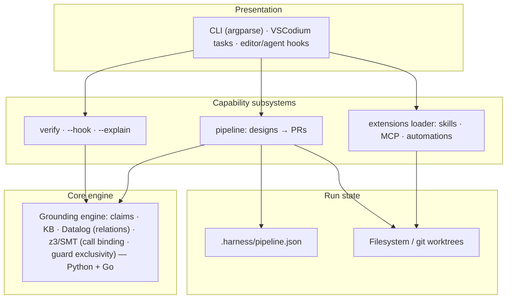
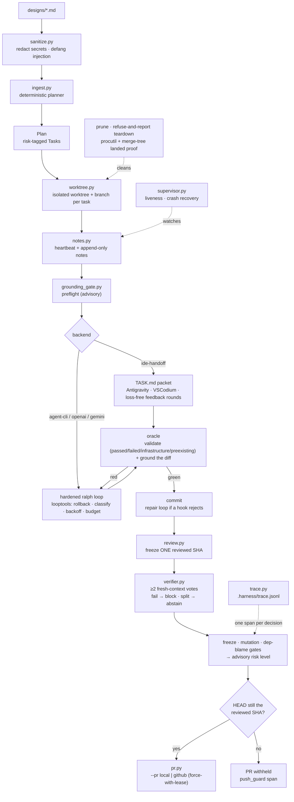
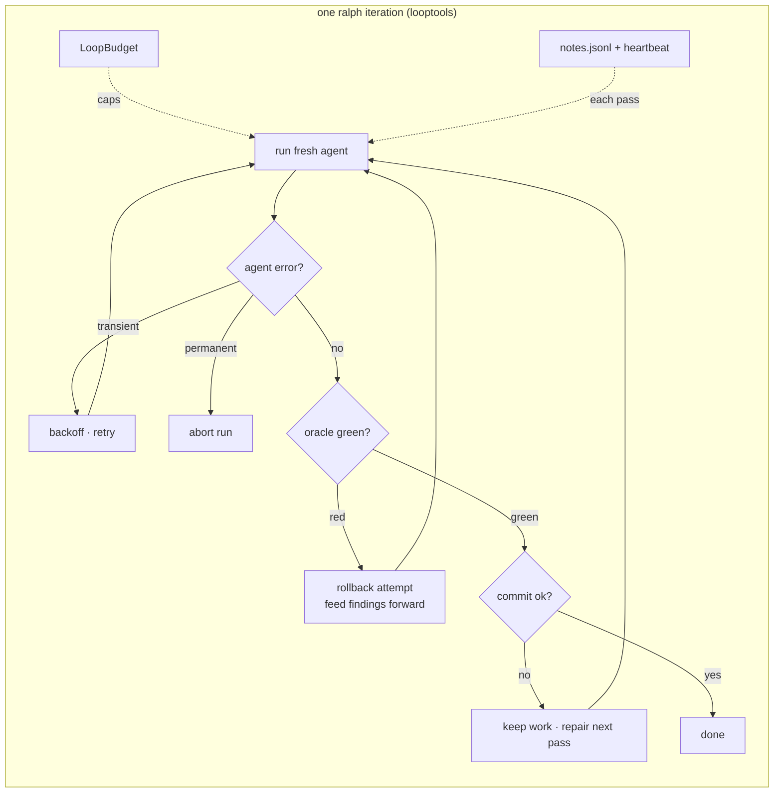
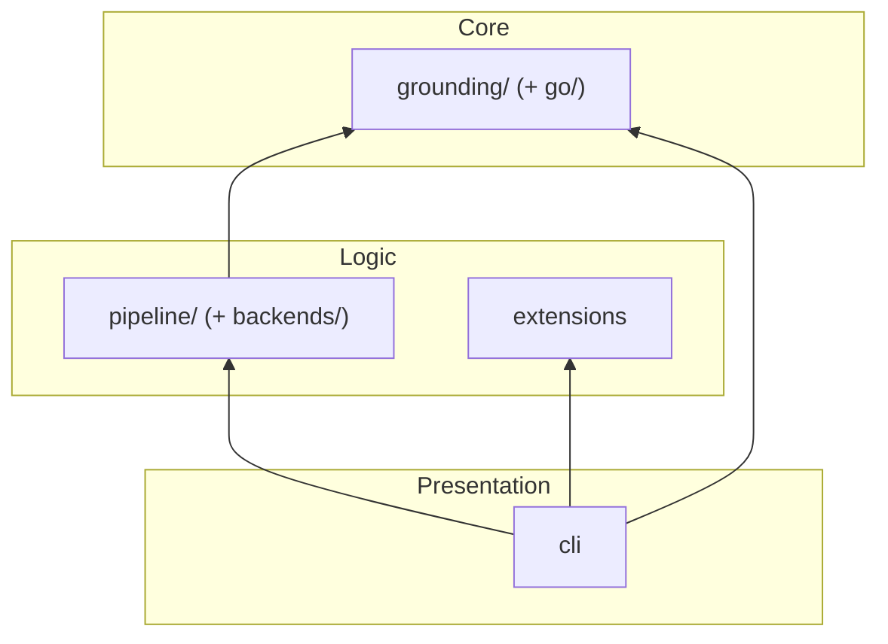

# 🏗️ System Architecture

> A deep-dive into the internal architecture of Harness — the neuro-symbolic
> **grounding gate** and the **design-docs → PRs** pipeline built on top of it.

---

## Table of Contents

- [High-Level Overview](#high-level-overview)
- [Component Breakdown](#component-breakdown)
  - [CLI Layer](#cli-layer)
  - [Pipeline Layer (design-docs → PRs)](#pipeline-layer-design-docs--prs)
- [Extension Points](#extension-points)
- [Observability](#observability)
- [Error Handling](#error-handling)
- [Thread Safety](#thread-safety)
- [Design Decisions](#design-decisions)

---

## High-Level Overview

Harness is a set of **capability subsystems** (verify, pipeline, extensions)
over one shared **core engine** — the neuro-symbolic **grounding engine**. The
`verify` gate and the design-docs → PRs pipeline both depend on grounding;
pipeline run-state lives in a repo-local JSON plan and git worktrees. Each
subsystem depends only on the core below it, keeping every component
independently testable.



---

## Component Breakdown

### CLI Layer

**Module:** `harness/cli.py`

The CLI is the sole entry point for user interaction. It uses Python's
`argparse` to define a tree of subcommands over the grounding gate, the
pipeline, and the extensions loader.

#### Responsibilities

- Parse command-line arguments into structured requests
- Dispatch to the grounding gate, the pipeline, or the extensions loader
- Format and colorise output for the terminal
- Handle keyboard interrupts and graceful shutdown
- Surface exit codes as a CI / pre-commit contract (see [Exit Codes](#exit-codes))

#### Subcommand Tree

```
harness [-v|-vv|-q] [--log-file PATH] [--version]
├── verify [FILE|-] [--project] [--lang] [--explain] [--hook] [--solver] [--require-z3]
│                                                   # Grounding gate (Python/Go); --hook = editor side-car
├── pipeline                                        # Design-docs → PRs
│   ├── plan   [--repo] [--designs] [--test-cmd|--type-cmd|--lint-cmd] [--base]
│   │                                               #   decompose designs/*.md → risk-tagged tasks
│   ├── run    [--backend] [--pr] [--parallel] [--task] [--max-iters]
│   │          [--max-tokens] [--max-cost] [--untrusted] [--mutation-min]
│   │          [--no-verify] [--verify-samples] [--no-progress-window]
│   │          [--no-dep-blame-gate] [--require-z3] [--validation-baseline] [--no-pr]
│   ├── status                                      #   show plan / task state
│   ├── tmux   [--max] [--no-attach]                #   one visible window per feature + dashboard
│   ├── complete <task-id> [--pr] [--no-pr] [--mutation-min]
│   │                                               #   finish an IDE-implemented task → PR
│   ├── supervise [--recover]                       #   liveness report + crash recovery
│   ├── prune  [--allow-unlanded] [--allow-dirty] [--force]
│   │                                               #   refuse-and-report teardown of landed worktrees
│   ├── trace  [--task] [--type] [-n]               #   inspect the span-trace journal
│   ├── verify-diff [--backend] [--base] [--intent] [--verify-samples]
│   │                                               #   ≥2 fresh-context verifiers over the working diff
│   └── backends                                    #   list code-writing backends
├── extensions [--init] [--skills-prompt] [--mcp-config]
│                                                   # List/scaffold drop-ins; emit machine-readable handoffs
└── status                                          # Grounding solver, backend availability, dependencies, extensions
```

`-v`/`-vv`/`-q`/`--log-file` are accepted at *both* levels, so
`harness -vv pipeline run` and `harness pipeline run -vv` are equivalent.

#### Output Formatting

The CLI uses ANSI escape codes for rich terminal output:

| Element | Colour | Example |
|---|---|---|
| Success | Green (`\033[32m`) | ✅ Grounded |
| Warning | Yellow (`\033[33m`) | ⚠️ z3 not found — call-binding/guard checks abstain |
| Error | Red (`\033[31m`) | ❌ Grounding failed |
| Info | Cyan (`\033[36m`) | ℹ️ Planning designs/ |

---

### Pipeline Layer (design-docs → PRs)

**Module:** `harness/pipeline/`

A layer built *on top of* the grounding engine that turns markdown **design
documents** into **pull requests** — one per independent task. It fuses the
shell-script loop in `loopeng/` — a plan → implement → review workflow
(`ralph.sh`, `orchestrate.sh`, `review.sh`) — with the harness's grounding gate,
and exposes the whole thing through `harness pipeline …` and editor tasks (no
tmux).



| Component | Responsibility |
|---|---|
| `ingest.py` | Parse `designs/*.md` → a `Plan` of independent, risk-tagged `Task`s. **Deterministic, LLM-free** — reads markdown structure (frontmatter, `## Tasks` checklist, sections), not vibes. |
| `spec.py` | `Task` / `Plan` / `PipelineConfig` data models + lifecycle (`pending → implementing → awaiting-human → review → done`, with `blocked`/`failed` terminal; the enum also defines a `grounding` status that is **defined but never entered** — tasks move straight `pending → implementing`). `PipelineConfig` carries every run knob and is the single place a default lives: unattended safety (`reset_on_failure`, `max_agent_retries`, `backoff_base_seconds`, `max_consecutive_failures`, `no_progress_window`, `max_tokens`, `max_cost_usd`, `quota_wait_cap_seconds`, `max_quota_waits`, `prevent_sleep`), trust/supervision (`untrusted_designs`, `kill_worktree_procs`, `reset_worktree_on_reuse`, `worktree_stale_seconds`, `max_task_attempts`), gates (`verify`, `verify_samples`, `dependency_blame_gate`, `require_z3`, `validation_baseline`, `mutation_min_score`/`mutation_max_mutants`/`mutation_timeout`, `trace`) and agent invocation (`allowed_tools`, `agent_model`, `agent_fallback_model`, `max_agent_turns`, `openai_*`, `gemini_model`, `api_timeout_seconds`). `from_env` fills any gap a CLI flag left from `HARNESS_*`; the field↔env↔flag mapping is tabulated in [PIPELINE.md § Complete configuration reference](PIPELINE.md#complete-configuration-reference). |
| `grounding_gate.py` | Wraps `harness.grounding.Preflight` as (a) a **preflight** over the design's code blocks and (b) a **per-change oracle** that grounds the worktree's changed `.py`/`.go` files. |
| `worktree.py` / `gitutil.py` | One isolated `git worktree` + `agent/<id>` branch per task (the fan-out from `orchestrate.sh`). Now also: **fail-closed teardown** (dirty trees, in-use trees and unmerged branches are *refused and reported*, each behind its own opt-in — `allow_dirty` / `allow_unlanded` / `in_use`), **merged-aware `prune`** (squash-merge `merge-tree` proof, plus directory reconciliation for worktrees the plan no longer knows about), and **opt-in warm reuse** (`reset_clean`, wired behind `reset_worktree_on_reuse`; **off** by default because harness reuses a worktree to *resume the same task*). `gitutil` adds the landed-work / force-with-lease / no-sign git plumbing. |
| `backends/` | The pluggable *code-writer*. `ide-handoff` (grounded `TASK.md` packet + loss-free review rounds — pairs with Google Antigravity or any editor), `agent-cli` (unattended non-interactive loop over an agent CLI — `gemini -p` by default; optional flags are passed only when the installed CLI's `--help` advertises them) and `openai`/`gemini` (stdlib-HTTP loop). All share the **hardened ralph loop** and the same oracle. |
| `looptools.py` | The unattended-safety primitives shared by the loop backends: failure classification (permanent vs. transient), exponential backoff, the token/cost `LoopBudget`, and the commit-failure repair prompt. |
| `notes.py` | Per-task run log: an **append-only** iteration history (`notes.jsonl`/`.md`) fed forward as cross-iteration memory, plus the liveness `heartbeat.json` — which binds the pid to a **process identity** (`/proc/<pid>` start time + cmdline, `ps lstart` on macOS) so a recycled pid can't read as alive, records a monotonic reading + boot id so a backward clock step can't read as *fresh*, and carries a per-incarnation **generation** token (minted by `TaskClaim.acquire`) so a previous run's leftover heartbeat is recognisable as such. |
| `supervisor.py` | Reads heartbeats to report **liveness** (`pipeline supervise`) and **recover crashes**. Recovery is *conservative and non-destructive*: anything unverifiable (absent/unreadable heartbeat, wrong generation, unmeasurable age) classifies **`unknown`** and is reported but never acted on — a rollback needs positive proof of death — and a stale task's worktree keeps its committed work *and* has its uncommitted edits parked on the **stash** before the reset. The recovery record is persisted (mode `0600`, `.harness/recovery/`) **before** any escalation hook is invoked, and re-announced (bounded) until acknowledged. |
| `procutil.py` | Best-effort termination of processes still running inside a worktree before it's removed (psutil — the `[proc]` extra — with a `/proc` fallback). Never signals **this process or its ancestors** (a `cd <worktree> && prune` would otherwise SIGKILL the calling shell), fails **closed** if that ancestor walk can't be completed, never signals a **bare pid** (each candidate carries the psutil `Process` from the scan, or `/proc`'s start time, so a pid recycled during the SIGTERM→SIGKILL grace window is left alone), and **re-scans** after the SIGKILL sweep so a survivor aborts the removal instead of racing it. |
| `shutdown.py` | Graceful stop on Ctrl-C / SIGTERM. Every agent invocation is launched **detached** (`start_new_session=True`), so a terminal interrupt reaches only the orchestrator — the agent CLI and its Bash grandchildren would keep editing the worktree and spending tokens. The handler signals the registered process *groups*, sets a flag the loops check (never an exception: a loop that just spent money must still record what it spent), and lets each backend write its own `abort` note + `aborted` beat and return — so the `TaskClaim` is released by the normal `finally`, not by process death. A **second** signal SIGKILLs and exits immediately, so a wedged shutdown stays escapable. |
| `nosleep.py` | Holds a host sleep inhibitor for the length of a run (`systemd-inhibit --what=sleep:idle` on Linux, `caffeinate -dimsu` on macOS, no-op elsewhere; `prevent_sleep`, on by default). A laptop that suspends mid-iteration loses the night outright. (The heartbeat itself is safe on Linux — age comes from `CLOCK_MONOTONIC`, frozen across a suspend, when the boot_id matches; only the wall-clock fallback path, e.g. macOS, ages a suspended run toward `worktree_stale_seconds`.) Fails **open**: a missing binary logs a line and the run continues. |
| `sanitize.py` | Treats design text as untrusted: redacts secrets, defangs prompt-injection delimiters, and wraps it in a *data-not-instructions* fence before it reaches any agent prompt or packet. |
| `trust.py` | The fail-closed allowlist for *executable* config taken from a design: in `untrusted_designs` mode a design's `(validate:)` commands are filtered to known test/build runners; everything else is dropped. |
| `verifier.py` | The **independent verifier gate** — the anti-hallucination axis grounding cannot cover (*does the diff do what was asked*). Fresh-context model calls that never saw the implementer's reasoning answer factored (Chain-of-Verification) questions about the diff. **At least two vote per implementer**: `samples` is floored at 2 for the calls *and* re-applied to the **counted** votes, so a sample whose answer has no parseable verdict casts none and a lone surviving verdict abstains rather than deciding alone. Majority wins; a split with no strict majority abstains → `high` risk → human review. Fails **open** on infrastructure — but a schema-validated answer that ran and did not conform is a blocking `fail`, because failing open there deletes the gate exactly when output drift broke it. Also hosts `dependency_blame_finding`. |
| `review.py` | Validate + ground + run the freeze / mutation / dependency-blame / verifier gates + assign a **risk level** (`low`/`medium`/`high`) — **advisory** routing metadata that prioritises human review (`review.sh`); harness **never auto-merges** on it. Freezes **one reviewed SHA** before anything is judged, so the oracle, the risk level and the push all refer to the same commit. Carries the oracle `feedback` back for loss-free IDE review rounds. |
| `mutation.py` | The optional mutation gate: applies deliberate breakages (comparison/boolean/arithmetic swaps, constant nudges) to the task's changed non-test source and scores how many the validation suite kills. Bounded by `mutation_max_mutants` × `mutation_timeout`; survivors are handed back to the agent as test-writing targets. |
| `trace.py` | The **span vocabulary** (21 `snake_case` types) and the append-only `.harness/trace.jsonl` writer. One JSON line per consequential decision, each under `PIPE_BUF` so concurrent per-task processes interleave whole lines; every write failure is swallowed — tracing must never break a run. Read back by `pipeline trace`. |
| `cockpit.py` | The tmux cockpit: one visible window per ready feature (each an independent `pipeline run --task <id>` process) plus a live dashboard window. Optional; `--parallel N` is the headless equivalent. |
| `pr.py` | Open the PR: `LocalBranchPR` (offline branch) or `GitHubPR` (`gh`). `head_bound_to_review` is the last check before an irreversible remote side effect — a HEAD that is not, and does not descend from, the reviewed SHA withholds the PR. `gh auth` is preflighted *before* the push, the body travels on stdin rather than argv, an existing PR is adopted only when its head ref matches and it is not cross-repository, and a rejected re-push retries with a bare `--force-with-lease` (refusing if the remote carries commits absent locally), never a blind `--force`. |
| `orchestrator.py` | `PipelineOrchestrator.run()` fans tasks across worktrees; serialises repo-level git mutations behind a lock; persists `implementing` **before** the backend call (crash-visible); recovers stale tasks at the start of each run; exposes `supervise()` / `prune()`. |
| `store.py` | Atomic, git-ignored, repo-local plan state at `.harness/pipeline.json` (resumable, multi-process-safe under a file lock), plus `RunLock` — the per-state-dir run flock that fails a second plan-wide run fast and stamps `HARNESS_ACTIVE_STATE_DIR` so nested runs refuse. |

The grounding gate is what distinguishes this from a bare plan→implement→review
loop: it runs **before** code is written (on the design) and **after every
change** (on the diff), refusing hallucinated modules / members / signatures, and
a failed grounding result forces the task to `high` risk so it is flagged for
human review (harness never auto-merges, regardless of risk).

The oracle's **validation** leg runs the repo's test suite and adds a **type
checker only when the repo is configured for one** — mypy or pyright installed
*and* configured for the repo, or a Go module (where `go build` type-checks by
construction). Type-checking is therefore conditional, not universal.

#### Unattended-safety, supervision & trust

The grounding gate is the *correctness* core; these three concerns are what make
the loop safe to **start and walk away from**. Each is a thin, independently
testable module with one job.



- **Unattended-safety (`looptools` + `notes`).** A red iteration is
  rolled back so it can't corrupt the next fresh agent; a transient model failure
  backs off and retries while a permanent one (credit/key) aborts; a green change
  that won't commit is **preserved** for a repair pass; a token/cost budget bounds
  the run; and every pass is journaled and fed forward. *Contribution to the
  agentic process:* the loop can run for hours without a human, and fails
  **safely and legibly** (clean worktree, honest reason) instead of silently
  corrupting state or burning budget.
- **Supervision (`supervisor` + `notes` heartbeats + `procutil`).**
  Heartbeats make a crashed or hung task observable;
  `pipeline supervise --recover` (and the start of each `run`) rolls a *provably*
  crashed task back to a clean, resumable state while keeping any committed green
  work and stashing its uncommitted work (unverifiable liveness is `unknown` and
  is never acted on);
  teardown is fail-closed and reclaims stray processes (never its own ancestor
  chain); `prune` removes only branches whose work has truly landed, reconciles
  worktree directories the plan lost track of, and *reports* what it refused to
  touch. *Contribution:* a fleet of parallel
  unattended agents is **observable and self-healing** — a killed run no longer
  wedges a task forever, and cleanup never destroys unmerged work.
- **Trust (`sanitize` + `trust` + `gitutil` hardening).** When
  the pipeline gates work you didn't write, design text is scrubbed of secrets and
  injection markers, design-declared validation commands are allowlist-filtered,
  validation runs shell-free where possible, re-pushes use `--force-with-lease`,
  and every git call is prompt/sign-hardened. *Contribution:* the autonomy above
  can be pointed at **untrusted input** without that input executing arbitrary
  commands or hijacking the agent.

See **[PIPELINE.md](PIPELINE.md)** for the run-book and the per-knob reference.

---

## Extension Points

Harness **discovers and lists** drop-in extensions from a conventional
directory; it does not run a plugin framework of its own. There are three kinds:

- **Skills** — packaged instruction sets (a `SKILL.md` + assets) that a coding
  agent loads on demand.
- **MCP servers** — Model Context Protocol servers declared for an agent to
  connect to.
- **Automations** — event-triggered commands. Harness *discovers and lists*
  them; an external **runner** (an agent hook or a git hook) is what
  actually fires them.

`harness extensions` enumerates what's installed; `harness extensions --init`
scaffolds the starter layout. See **[EXTENSIONS.md](EXTENSIONS.md)** for the
directory contract and the authoring guide.

---

## Observability

Two complementary channels (see **[LOGGING.md](LOGGING.md)**):

- **Span traces** (`pipeline/trace.py` → `.harness/trace.jsonl`) — one JSON
  line per consequential decision (gate verdicts, agent cost, status changes).
  Structured and append-only; the *what happened* record for unattended runs.
  The vocabulary is **21 `snake_case` types**, defined once in `trace.py`'s
  module docstring and tabulated in
  [PIPELINE.md § Span traces](PIPELINE.md#span-traces--harnesstracejsonl) —
  they are `jq` keys and `--type` filters, so a type spelled any other way, or
  added without documenting it, is a span nobody's saved query ever finds.
- **Verbose logs** (`harness/log.py`) — the human debugging narrative:
  subprocess commands with rc/duration, fallbacks and swallowed
  exceptions, state transitions with causes. Off by default (WARNING);
  `-v`/`-vv`/`HARNESS_LOG` turn the console up, `HARNESS_LOG_FILE` captures a
  full DEBUG log independent of the console. Pipeline log lines are stamped
  with `[run_id|task_id]` via `contextvars`, so parallel workers stay
  distinguishable. Every span is also mirrored to the debug log, so `-vv`
  interleaves both channels chronologically.

## Error Handling

Harness keeps its exception surface deliberately small — six classes, each
raised where a *caller must be able to branch on the reason*, and never as
control flow across subsystems:

| Exception | Raised by | Means |
|---|---|---|
| `Z3Unavailable` (`RuntimeError`) | `grounding.solver.get_solver` | z3 was **required** (`--require-z3` / `HARNESS_REQUIRE_Z3`) and is not usable. Loud on purpose: the alternative is a silent capability downgrade. |
| `Z3ProbeError` (`RuntimeError`) | `Z3Solver._probe` | z3 imported but cannot answer the queries harness will ask it. Raised during *construction*, the only window in which `get_solver` can still pick another backend. |
| `GuardParseError` (`ValueError`) | the guard-exclusivity encoder | a branch condition fell outside the decidable grammar → abstain, never a contradiction. |
| `GitError` (`RuntimeError`) | `gitutil` | a git invocation genuinely failed (as against "already gone", which is idempotent success). |
| `WorktreeInUse` (`GitError`) | `worktree` | **refuse-and-report**, not a failure: the worktree is dirty, has live processes, has survivors of the SIGKILL sweep, or is an unverifiable orphan. It is deliberately left on disk untouched; `reason` says which. |
| `AncestorLookupError` (`RuntimeError`) | `procutil` | the ancestor chain could not be resolved, so the sweep fails **closed** and signals nothing (it must never kill the shell that invoked it). |

Everything else is contained at each subsystem's boundary:

- **Pipeline** — one task's exception never kills the fleet:
  `PipelineOrchestrator._run_one()` has a catch-all that marks just that task
  `failed` (with the error recorded as a note) and moves on. `pipeline run`
  exits `1` when any attempted task ends `failed`, `blocked`, `error`,
  `unavailable`, `waiting-dependency` or `interrupted`, and `0` only when every
  attempted task succeeded — the contract wrapper loops and cron jobs depend on.
- **Gates** — fail **open** on infrastructure (a gate that cannot run never
  blocks a PR), with two stated exceptions: a broken *output contract* in the
  verifier, and an explicitly-requested capability (`--require-z3`).
- **Observability** — tracing and logging swallow every one of their own
  failures. Neither may ever change the outcome of a run.

### Exit Codes

| Code | Meaning |
|---|---|
| `0` | Success |
| `1` | Failure (e.g. `verify` grounding failed, a pipeline task failed) |
| `2` | Usage error (bad or missing arguments) |

`harness verify` doubles as a pre-commit / CI gate with this 0/1/2 contract:
`0` = grounded, `1` = grounding failed, `2` = usage error. `harness verify
--hook` (the editor/agent side-car) has its own contract: exit `0` = ok/skip,
exit `2` = findings (stderr is surfaced to the agent); internal errors exit `0`
so the hook can never break the edit loop. The single exception is an
explicitly-requested capability that is missing — `--require-z3` /
`HARNESS_REQUIRE_Z3=1` with no usable z3 exits `2` with the reason, because
failing open would silently turn the whole side-car into a no-op for the rest of
the session.

---

## Thread Safety

The CLI runs **single-threaded**. The **pipeline layer** (`harness/pipeline/`),
however, runs tasks **concurrently**: `PipelineOrchestrator.run()` fans tasks
across isolated git worktrees with a `ThreadPoolExecutor` sized by `--parallel`,
serialising only repo-level git mutations (worktree add, PR push/merge) behind
`_git_lock` and snapshotting the plan under a separate `_state_lock`. Per-task
run state — the append-only `notes` and the `heartbeat` — lives in a **separate
directory per task** (`.harness/runs/<id>/`), so concurrent workers never
contend on it; the only shared file, `.harness/pipeline.json`, is merged
per-task under an `flock` (`store.save_merged`) so concurrent processes can't
clobber each other. The `implementing` status is persisted *before* the long
backend call, so a crash mid-implement is recoverable by `supervisor` rather
than leaving a wedged task.

### Guarantees

| Component | Thread-Safe? | Mechanism |
|---|---|---|
| `.harness/pipeline.json` (`store`) | ✅ Yes | `flock` per-task merge (`store.save_merged`) |
| Per-task run dir (`notes` + `heartbeat`) | ✅ Yes | Separate directory per task — no cross-task contention |
| CLI | ❌ No | Single-threaded by design |
| `PipelineOrchestrator` | ⚠️ Parallel + locked | `ThreadPoolExecutor(max_workers=--parallel)` across isolated worktrees; repo-level git ops serialised behind `_git_lock`; plan snapshot under `_state_lock` |

---

## Design Decisions

### Why JSON over SQLite?

| Factor | JSON | SQLite |
|---|---|---|
| **Dependencies** | Zero (stdlib) | Requires `sqlite3` |
| **Human-readable** | ✅ Can open in any editor | ❌ Binary format |
| **Git-friendly** | ✅ Diffable | ❌ Binary diffs |
| **Schema flexibility** | ✅ Schemaless | Requires migrations |
| **Concurrent writes** | ⚠️ File locking needed | ✅ Built-in |
| **Query performance** | ❌ O(n) scans | ✅ Indexed queries |
| **Data volume** | Good for < 10K records | Good for any volume |

**Decision:** Harness prioritises **simplicity, transparency, and zero
dependencies**. Pipeline run-state is a plan of dozens of tasks per repo, kept
in a git-ignored `.harness/pipeline.json` (plus the append-only
`.harness/trace.jsonl`) — well within JSON's comfort zone, and diffable /
inspectable by hand.

### Why z3 is optional — and what it actually buys

The constraint layer sits behind `ConstraintSolver`, with two backends. z3 is
**not** a faster path to the same answers: an SMT query costs more than two
integer comparisons. It decides strictly *more*:

| Constraint kind | `builtin` | `z3` |
|---|---|---|
| `arity` — `lo ≤ argc ≤ hi` | ✅ | ✅ |
| `call_binding` — one model per call site: positional capacity ∧ required-parameter coverage ∧ the unknown number of parameters keyword arguments may bind | abstains | ✅ |
| `guard_exclusivity` — symbolic `if`/`elif` guards: branches that can never run, pairwise-exclusive guards | abstains | ✅ |

Every backend declares its kinds in `capabilities`; a kind it does not claim is
reported **`unverified`**, which never fails a gate. So the same code grounds
the same way with or without z3 — a z3-less machine loses findings, never gains
false ones. `--require-z3` / `HARNESS_REQUIRE_Z3=1` converts that silent
capability downgrade into a loud `Z3Unavailable` error for runs that must have
the full checks (CI, release gates).

### Why `argparse` over Click/Typer?

- **Zero dependencies:** Ships with Python.
- **Sufficient:** The CLI surface is small and flat (verify / pipeline /
  extensions / status).
- **Transparent:** No magic decorators or hidden state.
- **Future migration:** Easy to wrap with Click/Typer later if needed.

---

## Appendix: Module Dependency Graph



`extensions` deliberately has **no** edge to `grounding`: the loader imports only
the stdlib plus `harness.log`. It is a sibling leaf, not a consumer of the
grounding engine.

Dependencies flow strictly **upward** (presentation → logic → core). The
**grounding engine** is a leaf core with no harness dependencies — it's reusable
standalone (`harness verify`, `harness.grounding.preflight_check`). No circular
imports are permitted.
