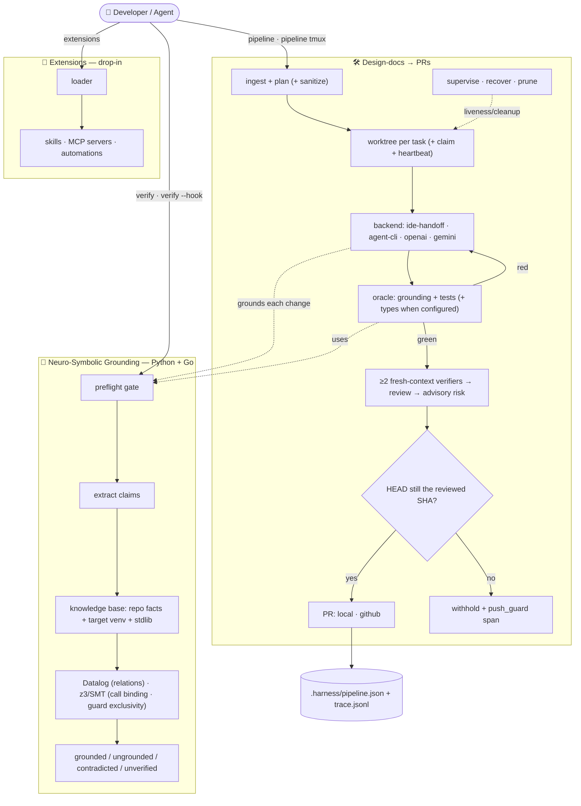

# 🔧 Harness — Neuro-Symbolic Grounding Gate + Design-Docs → PRs Pipeline

<!-- Badges -->


---

## Overview

**Harness's primary job is to run *before* implementation, on every coding attempt, to reduce hallucination.** Given a piece of proposed code (or a plan that names symbols), a neuro-symbolic **grounding** engine checks every referenced module, member, name and call signature against a symbolic knowledge base built from your codebase *and* the installed environment — and refuses to proceed when the attempt references things that do not exist. Hallucinated APIs (`np.aray(...)`, `json.dumsp(...)`, imports of modules that aren't there, calls with the wrong number of arguments) are caught up front instead of at runtime.

The grounding step is *neuro-symbolic*: the "neural" side proposes code; a **symbolic** layer (a built-in Datalog engine over facts extracted with `ast`/`importlib`, plus a pluggable constraint solver — z3/SMT when installed, a stdlib arity fallback otherwise) decides what is grounded, ungrounded, or contradicted. Use it as a CLI gate (`harness verify`), a library (`harness.grounding.preflight_check`), or automatically as the pipeline's preflight stage before any change is implemented.

Built on top of that gate, Harness has two pillars, both sharing the grounding spine:

1. **Design-docs → PRs pipeline** — drop markdown design docs in `designs/` and the pipeline plans them into independent tasks, implements each in an isolated git worktree (an `agent-cli` ralph loop — Gemini CLI by default — direct-API `openai`/`gemini` loops, or `ide-handoff` packets for Google Antigravity or VSCodium/Copilot), gates every change with **grounding + your test suite** (plus a type-checker leg when the repo is set up for it), has **at least two independent fresh-context verifiers** judge the diff, tags it with an advisory risk level, and opens one PR per task. See **[PIPELINE.md](PIPELINE.md)**.
2. **Drop-in extensions** — add skills, MCP servers, and automations by dropping a file in `extensions/`; the harness discovers and lists them, and a runner (an agent hook or a git hook) executes automations. See **[EXTENSIONS.md](EXTENSIONS.md)**.

The core runs on the Python standard library alone — no cloud services or API keys required to get started (z3 adds the SMT-decided grounding checks, and the `gemini`/`gh`/`tmux`/`go`/`npm` tools unlock optional integrations; `harness status` shows what's present and which constraint kinds your solver decides).

---

## ✨ Features

**Grounding & verification (the core)**
- 🧠 **Neuro-Symbolic Grounding** — A pre-implementation gate that grounds every referenced symbol/API/signature against a symbolic knowledge base to catch hallucinations before code is written. **Python** (`ast`/`importlib`) and **Go** (`go.mod`-aware source scan + the Go stdlib set), picked per file extension or `--lang`. Datalog over the relational layer; **z3/SMT** over the constraint layer — one satisfiability model per call site (**call binding**: positional capacity + required-parameter coverage + what keyword arguments may bind) and per `if`/`elif` chain (**guard exclusivity**: branches that can never run). Run as `harness verify`, as a library (`harness.grounding.preflight_check`), or as the pipeline's per-change oracle.
- 🧮 **z3 is capability, not speed** — without it the stdlib backend still decides call arity, and the SMT-only checks **abstain to `unverified`** (never a failure), so a z3-less machine loses findings but never gains false ones. Each backend declares its kinds in `capabilities`, and the z3 backend *probes* the API it needs at construction, so an incompatible release degrades cleanly instead of half-working. `--require-z3` / `HARNESS_REQUIRE_Z3=1` turns a missing or unusable z3 into a loud `Z3Unavailable` error instead of a silent downgrade.
- 🎯 **Grounded against the target environment** — third-party imports resolve against the *target project's* virtualenv (`.venv`/`venv` site-packages, found by path inspection — no target code is ever executed, no target interpreter launched) with the harness's own interpreter as the fallback tier. `HARNESS_TARGET_SITE_PACKAGES` force-adds directories for layouts the heuristic misses.
- 🔬 **Auditable rules (`--explain`)** — `harness verify --explain` prints the exact constraint generated for every call site and guard chain this run — the real z3 assertions, its inputs, and sat/unsat/abstained — so you can see *why* it passed or failed and that the rule is re-derived fresh each run.
- 🪝 **Grounding side-car (`--hook`)** — `harness verify --hook` reads a PostToolUse-style hook event (the JSON shape agentic CLIs emit from an after-edit hook) on stdin, grounds the edited `.py`/`.go` file, and puts findings in front of the agent (exit 2 → stderr) as the reason to fix them. PostToolUse runs *after* the write, so it **surfaces** — wire the same command to **PostToolBatch** (also handled, via `{"decision": "block"}`) when you want the loop halted. Drops into any agent CLI with after-edit hooks, a git `pre-commit` hook, an on-save task, or CI.

**Design-docs → PRs pipeline**
- 🛠️ **The loop** — Drop markdown design docs in `designs/`; the pipeline decomposes them into independent tasks, isolates each in a git worktree, implements (an `agent-cli` ralph loop, direct-API `openai`/`gemini` loops, or `ide-handoff` packets you build in **Google Antigravity or VSCodium/Copilot**), gates each change with **grounding + your test suite** (a type-checker leg is added only when mypy/pyright is installed and configured for the repo, or `go build` for Go), tags an advisory risk level, and opens one PR per task (`--pr local` or `--pr github`). See **[PIPELINE.md](PIPELINE.md)**.
- 🎓 **An oracle that knows what it couldn't run** — each validation command is classified `passed` / `failed` / `infrastructure` (the tool never got as far as judging the code) / `preexisting`. Only `failed` counts against the agent — but a suite where *nothing* ran is red, not a vacuous green, and an excuse the agent's own diff manufactured is revoked by re-running that command at the diff base. Tool versions (`{"pytest": "9.0.3"}`) are recorded so a verdict flip from a *tool upgrade* is distinguishable from a regression.
- 🌙 **Unattended-safe** — built to start and walk away from: a failed iteration is **rolled back** (no broken edits bleed forward), a transient model overload **backs off** (jittered, honouring a server `Retry-After`), a depleted-credit error **aborts**, an exhausted subscription **quota window is waited out** rather than burned through, a green change a hook rejects is **kept for repair**, and `--max-tokens` / `--max-cost` bound spend on every backend (the USD cap needs a known per-model rate — set `HARNESS_MODEL_PRICES` on `openai`/`gemini`, whose default models ship unpriced). A host **sleep inhibitor** holds the machine awake, and **Ctrl-C is safe** — the detached agent's process group is terminated, the abort is journaled, and the task stays resumable.
- 🛟 **Supervised & self-healing** — `harness pipeline supervise` reports per-task **liveness** (heartbeats bound to a *process identity*, a monotonic clock and a per-incarnation generation token, so a recycled pid, a clock step or a leftover record can never read as alive) and `--recover` rolls back **provably** crashed/hung runs, keeping committed work and parking uncommitted edits on the **stash**. Anything unverifiable is `unknown`: reported, never acted on. `harness pipeline prune` deletes only branches whose work has **landed** and reconciles worktree directories the plan lost track of; teardown is refuse-and-report, never bulldoze.
- 🛡️ **Safe on untrusted input** — design text is scrubbed of secrets + prompt-injection before it reaches a backend; `--untrusted` allowlist-filters a design's `(validate:)` commands *below* the executable (multiplexer subcommands, output-redirecting flags, and the `NAME=value` env prefix each get their own allowlist), adds what survives to the operator's oracle instead of substituting for it, and drops the branch's own agent config; validation runs shell-free where it can; re-pushes use `--force-with-lease`, never a blind force.
- 🔒 **Bound to the reviewed commit** — the risk level a PR carries only means something if the pushed tree earned it. The review freezes one SHA, and immediately before the push (under the repo git lock) a HEAD that no longer is — or descends from — that SHA withholds the PR and records a `push_guard` span. On GitHub, `gh auth` is checked *before* the push and an existing PR is adopted only when its head ref matches and it is not cross-repository.
- 🖥️ **Two front-ends** — Editor-first **VSCodium tasks** (the default), *or* a **tmux cockpit** (`harness pipeline tmux`) that runs several features simultaneously, one per window, with a live dashboard.
- 🔌 **Provider-agnostic backends** — the only model-coupled piece. `ide-handoff`, `agent-cli`, **`openai` (ChatGPT)**, and **`gemini`** ship in-tree (`agent-cli` drives an external agentic CLI — `gemini` by default; register a drop-in built on `AgentCliBackend(cli="<binary>")` to drive another — probing its `--help` and withholding the optional flags a CLI doesn't advertise; the API backends are direct, stdlib-HTTP, no SDK; truncated replies and refusals are detected from `finish_reason`/`refusal` and re-prompted rather than written to disk). Register your own (OpenCode, aider, an Azure endpoint, …) with one call. The grounding + test gate judges every backend identically. Risk level (low/medium/high) is **advisory routing metadata for review** — harness never auto-merges on it.

**Anti-hallucination gates (in the pipeline)**
- 🔎 **Independent verifiers (at least two)** — **fresh-context** second opinions re-read each diff against its task; whenever the gate is on, **≥ 2** independent verifiers vote per implementer. A failed verdict blocks the change; an abstain — including a split vote with no strict majority, or a round in which fewer than two verifiers answered usably — raises its risk to human review. Where the backend can enforce a JSON schema on the answer, the verdict is read from a validated object, and an answer that *ran* but did not conform **blocks** instead of silently skipping.
- 🔁 **No-progress / oscillation detector** — when N iterations reach the same failing state (or strictly alternate A,B,A,B), the task **abstains to a human** instead of thrashing.
- 🧯 **Dependency-blame gate** — a fix that edits vendored third-party code (`site-packages`, `node_modules`, …) is forced to **high risk**.
- 🧊 **Frozen acceptance tests + mutation scoring** — `(accept: …)` files encode the requirement and any diff touching them fails review; `(mutation: 0.7)` fails a green-but-toothless suite and hands the surviving mutants back as test-writing targets.
- 🙋 **Abstention** — a backend can emit an `ABSTAIN` sentinel to hand a task to **awaiting-human** rather than guess. The `debug-hypothesis` skill scaffolds the reasoning.

**Extensibility**
- 🧩 **Drop-in extensions** — Add **skills, MCP servers, and automations** by dropping a file into `extensions/` — no harness edit. `harness extensions` discovers and lists what's loaded (`--skills-prompt` / `--mcp-config` emit the machine-readable handoffs); a runner (an agent hook or a git hook) executes automations. Loading is symlink-guarded and never executes a drop-in. See **[EXTENSIONS.md](EXTENSIONS.md)**.

**Foundations**
- 🔍 **Dependency doctor** — `harness status` reports the grounding solver and the constraint kinds it decides, backend availability, every external tool it can use — `git`, `gh`, `tmux`, `agent` (the agent CLI driving the `agent-cli` backend; default binary `gemini`), `go`, `npm` — with its detected-vs-required version, the optional Python extras, and an extensions summary. See **[INSTALL.md](INSTALL.md)**.
- 📓 **Two observability channels** — an append-only JSONL **span trace** (`.harness/trace.jsonl`, one line per consequential decision) and a **verbose log** (`-v`/`-vv`, `HARNESS_LOG`) whose output is secret-redacted *and* terminal-safe. See **[LOGGING.md](LOGGING.md)**.
- 🧪 **Tested** — **1033 passing, 1 skipped**; the harness also grounds clean against itself — zero unresolved symbols across every module, with the optional extras (`.[z3,proc]`) installed. Without them, those two imports are the only expected findings.

---

## 🚫 What this does *not* do

Stated plainly, because a gate you misunderstand is worse than no gate:

- **It never auto-merges.** Risk (`low`/`medium`/`high`) is triage metadata for a human or an external runner. Every task lands as a PR you merge yourself.
- **Grounding proves *existence*, not correctness.** It answers "does this symbol/signature exist"; it cannot tell you the change does the right thing. That axis belongs to your test suite and the independent verifiers — which are model calls, and are wrong sometimes.
- **Gates fail *open* on infrastructure.** A verifier that cannot run, a solver that cannot decide, a `go vet` that isn't applicable — none of these block a PR. The one deliberate exception is a broken *output contract* (a schema-validated verifier answer that didn't conform) and an explicitly-requested capability (`--require-z3`), which fail loudly instead.
- **Without z3 you lose findings.** `call_binding` and `guard_exclusivity` abstain to `unverified` on the builtin solver. That is honest, not silent — but it is a smaller check.
- **The planner is deterministic, not clever.** `designs/*.md` are decomposed by reading markdown structure. A vague design yields a vague task.
- **Extensions are never executed by harness.** Skills, MCP manifests and automations are discovered and listed. A runtime you control does the running.
- **The unattended loop needs a disposable branch.** An agent with shell access, pointed at a repo you do not own, executes with whatever it can reach; the tool allowlist is the containment boundary and it is scoped on purpose.

The hardening changes considered and deliberately **not** adopted, each with the
condition that would reopen it, are kept as a standing ledger in
[PIPELINE.md](PIPELINE.md) (the do-not-adopt ledger).

---

## 🏛️ Architecture

Three entry points share one **neuro-symbolic grounding** spine:



> The grounding gate is the shared spine: `verify`/`--hook` call it directly, and
> the pipeline uses it both as a preflight and as the per-change oracle.

Full deep-dive: **[ARCHITECTURE.md](ARCHITECTURE.md)**.

---

## 🚀 Quick Start

### Prerequisites

| Requirement | Version | Purpose |
|---|---|---|
| Python | ≥ 3.10 | Runtime |
| git | any recent | The design-docs → PRs pipeline (worktrees, branches) |
| pip | latest | Package installation |
| Node.js / npm | any recent *(optional)* | JS/TS repos the pipeline validates via an `npm test` oracle |

### Installation

```bash
# Clone the repository (or your fork)
git clone https://github.com/your-org/harness-oss.git
cd harness-oss

# Create a virtual environment
python -m venv .venv
source .venv/bin/activate  # Linux / macOS
# .venv\Scripts\activate   # Windows

# Install in editable mode (core is stdlib-only — no third-party packages)
pip install -e .

# Optional extras (see INSTALL.md for the full dependency matrix):
pip install -e ".[z3]"     # SMT grounding: call-binding + guard-exclusivity checks
pip install -e ".[proc]"   # psutil: reclaim processes inside a worktree before teardown
pip install -e ".[dev]"    # pytest, mypy, ruff — to run the test suite
```

Optional external tools — `gh` (GitHub PRs), `tmux` (the simultaneous-features
cockpit), `gemini` (the agent CLI behind the unattended backend + the review
verifier), `go` (Go-grounding stdlib augmentation), `npm` (JS/TS test oracle) —
are installed via your OS package manager / vendor. Run **`harness status`** to see what's present and what each
unlocks. Full setup guide: **[INSTALL.md](INSTALL.md)**.

### First Run

```bash
# Verify installation and check system dependencies
harness status
```

Expected output (abridged — this machine has z3 installed; without it the solver
line reads `builtin  decides: arity`):

```
  Harness Status

Grounding solver: z3  decides: arity, call_binding, guard_exclusivity

Backends:
  • agent-cli — ✔ available
  • gemini — ✗ set GEMINI_API_KEY (or GOOGLE_API_KEY) to use the gemini backend
  • ide-handoff — ✔ available
  • openai — ✗ set OPENAI_API_KEY to use the openai backend

Dependencies (see INSTALL.md):
  ✔ git — required for the design-docs → PRs pipeline (worktrees, branches)
  ✔ gh — `pipeline --pr github` (open real GitHub PRs) — >= 2.97.0 recommended  2.97.0 (require >= 2.97.0)
  ✔ tmux — `pipeline tmux` cockpit (watch several features at once)
  ✔ agent — the agent-cli backend (unattended ralph loop) + the review verifier (default binary: gemini)
  ✗ go — Go grounding: augments the stdlib set via `go list std` (optional)
  ✔ npm — JS/TS repos the pipeline validates via an `npm test` oracle (optional)
  ✔ z3 — SMT solver: call-binding + guard-exclusivity grounding (optional; those checks abstain without it)
  ✔ psutil — reclaim processes still running inside a worktree before it is removed

Extensions: 2 skill(s), 1 MCP server(s), 2 automation(s)   (harness extensions)
```

The version column is a *pair* on purpose: "installed" and "recent enough to be
safe" are different states. Every shipped floor is a warning; the same tables
also support hard minimums (a tool below one makes the dependent feature report
itself unavailable), and operators can pin floors — soft or hard — for the agent
CLI they drive (see [INSTALL.md § Why those minimums](INSTALL.md#why-those-minimums)).

---

## 📖 Usage

### Pre-Implementation Grounding (primary)

Ground a file of proposed code against your project + environment before you commit to it. Exits non-zero when something is hallucinated, so it drops straight into a pre-commit hook or CI:

```bash
# Ground a file (or '-' for stdin); --project sets the codebase to index.
# Language is auto-detected from the extension (.py / .go), or force it with --lang.
harness verify proposed_change.py --project .
harness verify proposed_change.go --project .   # Go: go.mod-aware
harness verify proposed_change.py --explain     # show every constraint generated
harness verify proposed_change.py --require-z3  # refuse to run without the SMT checks
```

```
Grounding FAILED [z3]  grounded=4 ungrounded=1 contradicted=2 unverified=0
  ✗ proposed_change.py:7 [member] np.aray(...) → numpy.aray  (did you mean: array?)
  ⚠ proposed_change.py:9 [arity] os.getcwd(...) called with 1 positional arg(s); expects exactly 0
  ⚠ proposed_change.py:14 [guard] branch 'elif n < -5' can never run — every case it matches is already caught by an earlier branch
```

The last finding is z3-only: on the builtin backend that guard chain is reported
`unverified` instead (an honest "cannot decide", which never fails the gate).
`--require-z3` refuses to run at all rather than lose it silently.

Each finding is prefixed `path:lineno` whenever a path is known. Reading the
proposed change from **stdin** (`harness verify -`) is the one case with no path,
and only there does the prefix degrade to a bare `L7` — worth knowing if you are
writing an editor problem matcher or a CI log grep against this output.

As a library — the pipeline uses this same call as its preflight gate and per-change oracle:

```python
from harness.grounding import preflight_check
report = preflight_check(proposed_code, project_root=".")
if not report.ok:
    print(report.render())          # blocks; lists every hallucinated symbol
```

### Design-docs → PRs pipeline

Turn markdown design documents into pull requests, one per task, each grounded
against your real codebase. Driven from VSCodium/Copilot (or the CLI):

```bash
# 1. Decompose every designs/*.md into a task plan
harness pipeline plan --repo . --designs designs

# 2a. Prepare a grounded TASK.md packet per task to implement in your editor…
harness pipeline run --repo . --backend ide-handoff --pr local
harness pipeline complete <task-id> --pr local      # after you implement it

# 2b. …or let an unattended agent-cli ralph loop (Gemini CLI by default) write +
#     verify the code, bounded by a budget (rolls back failures, recovers
#     crashes). --max-tokens and --max-cost both work on every backend — on
#     agent-cli both are parsed best-effort from the CLI's JSON envelope; on
#     openai/gemini cost is an estimate from a per-model rate table, and they
#     report tokens only. NOTE: the *default* openai/gemini models are NOT in
#     that table, so --max-cost cannot fire on them until you set
#     HARNESS_MODEL_PRICES (harness warns at task start; --max-tokens is
#     unaffected).
harness pipeline run --repo . --backend agent-cli --pr github --parallel 3 \
                     --max-tokens 5000000 --max-cost 20

# 3. Operate the fleet: liveness + crash recovery, and merged-branch cleanup
harness pipeline supervise --repo . --recover   # 🟢 alive · 🔴 stale · ⚪ idle · ❓ unknown · ✅ done
harness pipeline prune     --repo .             # delete only landed agent/* branches

# 4. Read the morning after: the span trace of every gate decision
harness pipeline trace --repo . --type review -n 20
```

In VSCodium: **Tasks: Run Task → `Harness: Plan from designs`**, then
`Harness: Run — IDE handoff (prepare task packets)`. Full run-book:
**[PIPELINE.md](PIPELINE.md)**.

### Second opinion on a working diff

The review-time verifier gate, standalone — no worktree, no plan, no PR. It
grounds the changed files, runs the dependency-blame check, and asks **≥ 2**
fresh-context judges whether the diff does what `--intent` says. Exit `1` only on
an explicit FAIL:

```bash
harness pipeline verify-diff --repo . --base main \
    --intent "cache the parsed config so repeated loads don't re-read the file"
```

### Extensions

```bash
harness extensions                  # list every discovered drop-in (+ malformed ones)
harness extensions --init           # scaffold skills/ mcp/ automations/
harness extensions --skills-prompt  # the <available_skills> block for a system prompt
harness extensions --mcp-config     # the merged {"mcpServers": …} JSON
```

### System Check

```bash
harness status
```

---

## 🗂️ Project Structure

```
harness/
├── harness/
│   ├── __init__.py            # Package init & version
│   ├── cli.py                 # CLI entry point (argparse)
│   ├── config.py              # External-tool detection, version floors, what each unlocks
│   ├── log.py                 # Verbose logging (-v/-vv, HARNESS_LOG) + redaction
│   ├── extensions.py          # Drop-in loader (skills/mcp/automations)
│   ├── grounding/             # Neuro-symbolic pre-implementation grounding
│   │   ├── knowledge.py       # Symbolic KB: repo facts (ast) + target-venv/lib introspection
│   │   ├── claims.py          # Extract claims from proposed code (alias-aware)
│   │   ├── datalog.py         # Built-in Datalog engine (relational reasoning)
│   │   ├── solver.py          # Constraint solver: z3/SMT (call binding, guard exclusivity, arity) + stdlib arity fallback
│   │   ├── reasoner.py        # Ground claims → verdicts
│   │   ├── report.py          # GroundingReport (grounded/ungrounded/contradicted/unverified)
│   │   ├── preflight.py       # Preflight gate (high-level, language-aware)
│   │   └── go/                # Go backend: stdlib set, go.mod KB, claims, reasoner
│   └── pipeline/              # Design-docs → PRs loop (see PIPELINE.md)
│       ├── ingest.py          # Parse designs/*.md → deterministic task plan
│       ├── spec.py            # Task / Plan / PipelineConfig (every knob + its env var)
│       ├── grounding_gate.py  # Grounding as preflight + per-change oracle (.py/.go)
│       ├── worktree.py        # Isolated worktree per task; refuse-and-report teardown, prune, warm reuse
│       ├── gitutil.py         # git CLI wrappers + landed-proof / force-with-lease / no-sign
│       ├── backends/          # Pluggable code-writers (ide-handoff, agent-cli, openai, gemini)
│       ├── looptools.py       # Unattended-safety: failure classifier, backoff, quota wait, budget, progress ledger
│       ├── verifier.py        # Independent fresh-context verifiers (≥2 votes per diff)
│       ├── notes.py           # Per-task run notes, liveness heartbeat + TaskClaim (flock)
│       ├── supervisor.py      # Liveness reporting (supervise) + crash recovery
│       ├── procutil.py        # Terminate processes still inside a worktree before teardown
│       ├── shutdown.py        # Graceful Ctrl-C/SIGTERM: terminate the detached agent, record the abort
│       ├── nosleep.py         # Keep the host awake for the run (systemd-inhibit / caffeinate)
│       ├── sanitize.py        # Scrub untrusted design text (secrets + prompt-injection)
│       ├── trust.py           # Fail-closed allowlist for design-provided validation commands
│       ├── review.py          # Review gate, advisory risk routing, reviewed-SHA freeze
│       ├── mutation.py        # Optional mutation check on the change
│       ├── trace.py           # Per-task decision trace (pipeline trace) — the span vocabulary
│       ├── pr.py              # Local-branch / GitHub (gh) PR creation + push guard
│       ├── cockpit.py         # tmux cockpit (run features simultaneously)
│       ├── orchestrator.py    # Ties ingest→ground→implement→verify→review→PR; recovery + supervise/prune
│       └── store.py           # Repo-local plan persistence (.harness/pipeline.json) + the run lock
├── tests/                     # 1033 passing, 1 skipped (pytest; config in pytest.toml)
│   ├── conftest.py            # Isolated cwd/data per test
│   ├── test_grounding.py      test_grounding_explain.py  test_grounding_z3.py
│   ├── test_grounding_go.py   test_grounding_precision.py
│   ├── test_pipeline.py       test_api_backends.py       test_pr_github.py
│   ├── test_antihallucination.py  test_extensions.py     test_liveness.py
│   ├── test_trace_and_mutation.py test_verify_hook.py    test_acceptance_version.py
│   ├── test_hardening.py      test_deep_review_fixes.py  test_batch4.py  test_batch5.py
│   ├── test_cli_error_surfacing.py   test_commit_and_paths.py
│   ├── test_detached_children.py     test_publication_guards.py
│   ├── test_recovery_integrity.py    test_ref_safety.py
│   ├── test_run_entry_guards.py      test_untrusted_gates.py
│   └── test_verifier_manifest_guard.py  test_worktree_process_safety.py
├── designs/                   # ← drop your design .md files here (pipeline input)
│   ├── TEMPLATE.md
│   └── example-pipeline-clean.md
├── extensions/                # ← drop-in skills/mcp/automations (EXTENSIONS.md)
│   ├── skills/  mcp/  automations/
│   └── README.md
├── .vscode/                   # VSCodium/VS Code tasks, launch, grounding matcher
├── loopeng/                   # The shell-script loop this pipeline is built from
├── README.md
├── AGENTS.md                  # agent context file: the gates + constraints a coding agent must hold to
├── INSTALL.md                 # setup + dependency matrix
├── EXTENSIONS.md              # drop-in extensions guide
├── PIPELINE.md                # design-docs → PRs run-book + full config reference
├── ARCHITECTURE.md  CONTRIBUTING.md  LOGGING.md
├── pytest.toml  mypy.ini  ruff.toml  # suite + type + lint config (no pyproject.toml, on purpose)
├── MANIFEST.in  setup.py  requirements.txt
```

---

## ⚙️ Configuration

Configuration is via environment variables and CLI flags (there is no config
file). Explicit flags win; an unset flag falls through to the environment. The
pipeline keeps its plan in a repo-local `.harness/pipeline.json`; no global data
store is created.

The table below is the **selected** set most runs touch. Every
`PipelineConfig` field, its env var, its CLI flag and its default is in
**[PIPELINE.md § Complete configuration reference](PIPELINE.md#complete-configuration-reference)**.

| Variable | Purpose | Default |
|---|---|---|
| `HARNESS_REPO`, `HARNESS_DESIGNS` | Pipeline target repo / designs dir | `.` / `designs` |
| `HARNESS_BACKEND`, `HARNESS_PR`, `HARNESS_PARALLEL`, `HARNESS_MAX_ITERS` | Pipeline backend / PR mode / parallelism / ralph cap | `ide-handoff` / `local` / `1` / `15` |
| `HARNESS_TEST_CMD`, `HARNESS_TYPE_CMD`, `HARNESS_LINT_CMD` | Override the pipeline oracle commands | auto-detected |
| `HARNESS_MAX_TOKENS`, `HARNESS_MAX_COST_USD` | Budget caps that stop an unattended run (tokens on any token-tracking backend; USD parsed best-effort from the agent CLI's JSON envelope on **agent-cli**, estimated on `openai`/`gemini` — and only for models the rate table prices, which the shipped defaults are **not**: see `HARNESS_MODEL_PRICES`) | unbounded |
| `HARNESS_MODEL_PRICES` | Per-model USD rates for the API backends: `model=in/cached/out` per 1M tokens, comma-separated. **Required for `HARNESS_MAX_COST_USD` to have any effect on the default `openai`/`gemini` models** — the built-in table knows only `gpt-4.1*`/`gpt-4o*`/`gemini-2.x`, so an unpriced model contributes $0 and the USD cap can never trip | unset |
| `HARNESS_VERIFY` | Independent verifier gate: ≥ 2 fresh-context second opinions on each diff (fail → block, abstain → high risk); `0` turns the gate off entirely | `1` (on) |
| `HARNESS_VERIFY_SAMPLES` | Independent verifier votes per diff — **minimum 2** while the gate is on; majority wins, a split → human review | `2` |
| `HARNESS_NO_PROGRESS_WINDOW` | Abstain to a human after N iterations reach the same failing state (`0` disables) | `3` |
| `HARNESS_DEP_BLAME_GATE` | Force high risk when a fix edits vendored third-party code (`site-packages`, `node_modules`, …) | `1` (on) |
| `HARNESS_MUTATION_MIN` | Fail review when the changed code's mutation score is below this ratio (0..1) | unset (off) |
| `HARNESS_REQUIRE_Z3` | Fail fast when the z3 solver is unavailable instead of degrading to the builtin backend (which abstains on `call_binding` / `guard_exclusivity`) | `0` (off) |
| `HARNESS_VALIDATION_BASELINE` | Run the oracle at the diff base first and don't blame the agent for a command already failing there. Changes what "passed" means — opt-in | `0` (off) |
| `HARNESS_UNTRUSTED_DESIGNS` | Allowlist-filter a design's `(validate:)` commands (fail-closed) and drop the branch's own agent config | `0` (trusted) |
| `HARNESS_PROTECTED_PATHS` | Comma-separated paths the pipeline's own catch-all `git add -A` must never sweep into a commit — an exact repo-relative path, a glob, a directory prefix, or a bare basename at any depth (`.env` catches `services/api/.env`). A match **refuses** the automatic commit and fails the review with the path and the rule in its reasons; index and worktree are left exactly as the agent left them | unset (empty — nothing is protected, behaviour unchanged) |
| `HARNESS_MAX_TASK_ATTEMPTS` | Park a task at the terminal `blocked` status after this many implement→review cycles *across runs* (`0` = unbounded) | `5` |
| `HARNESS_STALE_SECONDS` | Heartbeat age past which a task with a dead process is treated as crashed and recovered | `7200` |
| `HARNESS_PREVENT_SLEEP` | Hold a host sleep inhibitor for the length of a run (`systemd-inhibit` / `caffeinate`, no-op elsewhere) so a laptop can't suspend mid-iteration. Fails open when the binary is missing | `1` (on) |
| `HARNESS_TRACE` | Append one JSON span per gate decision to `.harness/trace.jsonl` | `1` (on) |
| `HARNESS_LOG`, `HARNESS_LOG_FILE` | Console log level (incl. per-module: `info,harness.grounding=debug`) / full-DEBUG file sink | `warning` / unset |
| `HARNESS_EXTENSIONS_DIR` | Where the drop-in `extensions/` are loaded from. The default is resolved against the **installed harness package**, *not* `HARNESS_REPO` — so when you point harness at another repository, set this explicitly or your target repo's `extensions/` is never scanned | `<harness-checkout>/extensions`, else `./extensions` in the cwd |
| `HARNESS_TARGET_SITE_PACKAGES` | `os.pathsep`-separated site-packages dirs to add when grounding a target project whose venv layout the heuristic misses | unset |
| `NO_COLOR` | Disable ANSI output (for editor problem matchers / hooks) | unset |

---

## 🤝 Contributing

We welcome contributions! Please see [CONTRIBUTING.md](CONTRIBUTING.md) for guidelines on:

- Setting up a development environment
- Adding backends, extensions, or grounding rules (including the **solver equivalence contract**)
- Code style, logging conventions, and testing requirements
- Pull request process

---

## 📄 License

**MIT** — see [LICENSE](LICENSE) (and the matching `license="MIT"` declared in
`setup.py`).

---

## 📚 Further Reading

| Document | Description |
|---|---|
| [INSTALL.md](INSTALL.md) | Install & setup — required vs optional deps, version floors, what each unlocks |
| [EXTENSIONS.md](EXTENSIONS.md) | **Drop-in** skills, MCP servers & automations (`extensions/`) |
| [PIPELINE.md](PIPELINE.md) | **Design-docs → PRs pipeline** run-book + the complete configuration reference |
| [ARCHITECTURE.md](ARCHITECTURE.md) | System architecture deep-dive |
| [LOGGING.md](LOGGING.md) | Verbose logs & spans: `-v/-vv`, `HARNESS_LOG`, the span vocabulary, recipes |
| [CONTRIBUTING.md](CONTRIBUTING.md) | How to contribute |
| [AGENTS.md](AGENTS.md) | The agent context file — contributor gates and constraints; Gemini CLI loads it via `context.fileName` |
