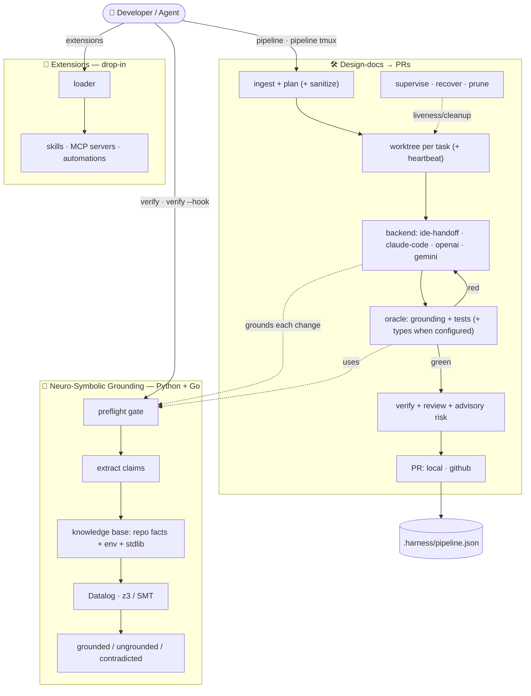

# 🔧 Harness — Neuro-Symbolic Grounding Gate + Design-Docs → PRs Pipeline

<!-- Badges -->


---

## Overview

**Harness's primary job is to run *before* implementation, on every coding attempt, to reduce hallucination.** Given a piece of proposed code (or a plan that names symbols), a neuro-symbolic **grounding** engine checks every referenced module, member, name and call signature against a symbolic knowledge base built from your codebase *and* the installed environment — and refuses to proceed when the attempt references things that do not exist. Hallucinated APIs (`np.aray(...)`, `json.dumsp(...)`, imports of modules that aren't there, calls with the wrong number of arguments) are caught up front instead of at runtime.

The grounding step is *neuro-symbolic*: the "neural" side proposes code; a **symbolic** layer (a built-in Datalog engine over facts extracted with `ast`/`importlib`, plus a pluggable constraint solver — z3 when installed, a stdlib fallback otherwise) decides what is grounded, ungrounded, or contradicted. Use it as a CLI gate (`harness verify`), a library (`harness.grounding.preflight_check`), or automatically as the pipeline's preflight stage before any change is implemented.

Built on top of that gate, Harness has two pillars, both sharing the grounding spine:

1. **Design-docs → PRs pipeline** — drop markdown design docs in `designs/` and the pipeline plans them into independent tasks, implements each in an isolated git worktree (an unattended agent loop — `claude-code`, `openai`, `gemini` — or editor-agnostic `ide-handoff` task packets), gates every change with **grounding + your test suite** (plus a type-checker leg when the repo is set up for it), tags it with an advisory risk level, and opens one PR per task. A stack of **anti-hallucination gates** (an independent fresh-context verifier, a no-progress/oscillation detector, a dependency-blame gate, and human abstention) guards every change. Drive it from the plain CLI, hand tasks to any editor, or watch several features at once in a **tmux cockpit**. See **[PIPELINE.md](PIPELINE.md)**.
2. **Drop-in extensions** — add skills, MCP servers, and automations by dropping a file in `extensions/`; the harness discovers and lists them, and a runner (a Claude Code hook or a git hook) executes automations. See **[EXTENSIONS.md](EXTENSIONS.md)**.

The core runs on the Python standard library alone — no cloud services or API keys required to get started (z3 and the `claude`/`gh`/`tmux`/`go`/`npm` tools are optional accelerators; `harness status` shows what's present).

---

## ✨ Features

**Grounding & verification (the core)**
- 🧠 **Neuro-Symbolic Grounding** — A pre-implementation gate that grounds every referenced symbol/API/signature against a symbolic knowledge base to catch hallucinations before code is written. **Python** (`ast`/`importlib`) and **Go** (`go.mod`-aware source scan + the Go stdlib set), picked per file extension or `--lang`. Datalog over the relational layer, **z3/SMT** for call-arity. Run as `harness verify`, as a library (`harness.grounding.preflight_check`), or as the pipeline's per-change oracle.
- 🔬 **Auditable rules (`--explain`)** — `harness verify --explain` prints the exact arity constraint (the z3/builtin rule) generated for every call this run, with its inputs and sat/unsat — so you can see *why* it passed or failed and that the rule is re-derived fresh each run.
- 🪝 **Grounding side-car (`--hook`)** — `harness verify --hook` reads a Claude Code PostToolUse event on stdin, grounds the edited `.py`/`.go` file, and feeds findings straight back to the agent (exit 2) so it self-corrects *before moving on*. Drops into Claude Code, a git `pre-commit` hook, an on-save task, or CI.

**Design-docs → PRs pipeline**
- 🛠️ **The loop** — Drop markdown design docs in `designs/`; the pipeline decomposes them into independent tasks, isolates each in a git worktree, implements (an unattended agent loop — `claude-code`/`openai`/`gemini` — or `ide-handoff` packets you implement in **any editor**), gates each change with **grounding + your test suite** (a type-checker leg is added only when mypy/pyright is installed and configured for the repo, or `go build` for Go), tags an advisory risk level, and opens one PR per task (`--pr local` or `--pr github`). See **[PIPELINE.md](PIPELINE.md)**.
- 🌙 **Unattended-safe** — built to start and walk away from: a failed iteration is **rolled back** (no broken edits bleed forward), a transient model overload **backs off** while a depleted-credit error **aborts**, a green change a hook rejects is **kept for repair**, and `--max-tokens` bounds spend on any token-tracking backend (`--max-cost` on **claude-code**). Every pass is journaled to an append-only run log.
- 🛟 **Supervised & self-healing** — `harness pipeline supervise` reports per-task **liveness** and `--recover` rolls back **crashed/hung** runs (keeping committed work); `harness pipeline prune` deletes only branches whose work has **landed**; teardown is fail-closed and reclaims stray processes.
- 🛡️ **Safe on untrusted input** — design text is scrubbed of secrets + prompt-injection before it reaches a backend; `--untrusted` allowlist-filters a design's `(validate:)` commands; validation runs shell-free where it can; re-pushes use `--force-with-lease`, never a blind force.
- 🖥️ **CLI-first, editor-friendly** — everything runs from the plain CLI; `ide-handoff` hands each task to **any editor** as a `TASK.md` packet (optional `.vscode/` task wrappers ship for VS Code-family editors); and a **tmux cockpit** (`harness pipeline tmux`) runs several features simultaneously, one per window, with a live dashboard.
- 🔌 **Provider-agnostic backends** — the only model-coupled piece. `ide-handoff`, `claude-code`, **`openai` (ChatGPT)**, and **`gemini`** ship in-tree (the API backends are direct, stdlib-HTTP, no SDK); register your own (OpenCode, aider, an Azure endpoint, …) with one call. The grounding + test gate judges every backend identically. Risk level (low/medium/high) is **advisory routing metadata for review** — harness never auto-merges on it.

**Anti-hallucination gates (in the pipeline)**
- 🔎 **Independent verifier** — a **fresh-context** second opinion re-reads each diff against its task; a failed verdict blocks the change, an abstain raises its risk.
- 🔁 **No-progress / oscillation detector** — when N iterations reach the same failing state, the task **abstains to a human** instead of thrashing.
- 🧯 **Dependency-blame gate** — a fix that edits vendored third-party code (`site-packages`, `node_modules`, …) is forced to **high risk**.
- 🙋 **Abstention** — a backend can emit an `ABSTAIN` sentinel to hand a task to **awaiting-human** rather than guess; opt-in **self-consistency** takes N verifier votes and sends a split to review. The `debug-hypothesis` skill scaffolds the reasoning.

**Extensibility**
- 🧩 **Drop-in extensions** — Add **skills, MCP servers, and automations** by dropping a file into `extensions/` — no harness edit. `harness extensions` discovers and lists what's loaded; a runner (a Claude Code hook or a git hook) executes automations. See **[EXTENSIONS.md](EXTENSIONS.md)**.

**Foundations**
- 🔍 **Dependency doctor** — `harness status` reports the grounding solver, backend availability, every external tool (git/gh/tmux/claude/go/npm) and what each unlocks, plus an extensions summary. See **[INSTALL.md](INSTALL.md)**.
- 🧪 **Tested** — the test suite passes (276 tests); the harness even grounds clean against itself (save one optional `psutil` import, flagged only when `psutil` isn't installed).

---

## 🏛️ Architecture

Three entry points share one **neuro-symbolic grounding** spine:



> The grounding gate is the shared spine: `verify`/`--hook` call it directly, and
> the pipeline uses it both as a preflight and as the per-change oracle.

---

## 🚀 Quick Start

### Prerequisites

| Requirement | Version | Purpose |
|---|---|---|
| Python | ≥ 3.10 | Runtime |
| pip | latest | Package installation |
| Node.js / npm | ≥ 18 *(optional)* | JS/TS repos the pipeline validates via an `npm test` oracle |

### Installation

```bash
# Clone the repository
git clone https://github.com/cabal19421/harness-oss.git
cd harness

# Create a virtual environment
python -m venv .venv
source .venv/bin/activate  # Linux / macOS
# .venv\Scripts\activate   # Windows

# Install in editable mode (core is stdlib-only — no third-party packages)
pip install -e .

# Optional extras (see INSTALL.md for the full dependency matrix):
pip install -e ".[z3]"     # z3-accelerated grounding
pip install -e ".[dev]"    # pytest, to run the test suite
```

Optional external tools — `gh` (GitHub PRs), `tmux` (the simultaneous-features
cockpit), `claude` (unattended backend), `go` (Go-grounding stdlib augmentation),
`npm` (JS/TS test oracle) — are installed via your OS package manager. Run
**`harness status`** to see what's present and what each unlocks. Full setup
guide: **[INSTALL.md](INSTALL.md)**.

### First Run

```bash
# Verify installation and check system dependencies
harness status
```

Expected output (abridged):

```
  Harness Status

Grounding solver: builtin  (install z3-solver for the accelerated backend)

Backends:
  • claude-code — ✔ available
  • gemini — ✗ set GEMINI_API_KEY (or GOOGLE_API_KEY) to use the gemini backend
  • ide-handoff — ✔ available
  • openai — ✗ set OPENAI_API_KEY to use the openai backend

Dependencies (see INSTALL.md):
  ✔ git — required for the design-docs → PRs pipeline (worktrees, branches)
  ✔ gh — `pipeline --pr github` (open real GitHub PRs)
  ✔ tmux — `pipeline tmux` cockpit (watch several features at once)
  ✗ claude — the claude-code backend (unattended ralph loop) + the review verifier
  ... (go, npm, z3 — each with what it unlocks)

Extensions: 2 skill(s), 1 MCP server(s), 2 automation(s)   (harness extensions)
```

---

## 📖 Usage

### Pre-Implementation Grounding (primary)

Ground a file of proposed code against your project + environment before you commit to it. Exits non-zero when something is hallucinated, so it drops straight into a pre-commit hook or CI:

```bash
# Ground a file (or '-' for stdin); --project sets the codebase to index.
# Language is auto-detected from the extension (.py / .go), or force it with --lang.
harness verify proposed_change.py --project .
harness verify proposed_change.go --project .   # Go: go.mod-aware
```

```
Grounding FAILED [builtin]  grounded=4 ungrounded=1 contradicted=1 unverified=0
  ✗ L7  [member] np.aray(...) → numpy.aray   (did you mean: array?)
  ⚠ L9  [arity]  os.getcwd(...) called with 1 arg(s); expects exactly 0
```

As a library — the pipeline uses this same call as its preflight gate and per-change oracle:

```python
from harness.grounding import preflight_check
report = preflight_check(proposed_code, project_root=".")
if not report.ok:
    print(report.render())          # blocks; lists every hallucinated symbol
```

### Design-docs → PRs pipeline

Turn markdown design documents into pull requests, one per task, each grounded
against your real codebase. Driven from the CLI — or hands-on from any editor:

```bash
# 1. Decompose every designs/*.md into a task plan
harness pipeline plan --repo . --designs designs

# 2a. Prepare a grounded TASK.md packet per task to implement in your editor…
harness pipeline run --repo . --backend ide-handoff --pr local
harness pipeline complete <task-id> --pr local      # after you implement it

# 2b. …or let an unattended claude-code ralph loop write + verify the code,
#     bounded by a budget (rolls back failures, recovers crashes). --max-tokens
#     works on any token-tracking backend; --max-cost is claude-code only.
harness pipeline run --repo . --backend claude-code --pr github --parallel 3 \
                     --max-tokens 5000000 --max-cost 20

# 3. Operate the fleet: liveness + crash recovery, and merged-branch cleanup
harness pipeline supervise --repo . --recover   # 🟢 alive · 🔴 stale · ✅ done
harness pipeline prune     --repo .             # delete only landed agent/* branches
```

VS Code-family editors get optional task wrappers for these commands
(`.vscode/tasks.json`: **Tasks: Run Task → `Harness: Plan from designs`**, then
`Harness: Run — IDE handoff (prepare task packets)`); JetBrains and every other
editor use the same CLI commands and the same `TASK.md` packets. Full run-book:
**[PIPELINE.md](PIPELINE.md)**.

### System Check

```bash
harness status
```

---

## 🗂️ Project Structure

```
harness/
├── harness/
│   ├── __init__.py            # Package init & version
│   ├── cli.py                 # CLI entry point (argparse)
│   ├── config.py              # External-tool detection + what each unlocks
│   ├── log.py                 # Verbose logging (-v/-vv, HARNESS_LOG)
│   ├── extensions.py         # Drop-in loader (skills/mcp/automations)
│   ├── grounding/            # Neuro-symbolic pre-implementation grounding
│   │   ├── knowledge.py      # Symbolic KB: repo facts (ast) + lib introspection
│   │   ├── claims.py         # Extract claims from proposed code (alias-aware)
│   │   ├── datalog.py        # Built-in Datalog engine (relational reasoning)
│   │   ├── solver.py         # Constraint solver: z3 (optional) + stdlib fallback
│   │   ├── reasoner.py       # Ground claims → verdicts
│   │   ├── report.py         # GroundingReport (grounded/ungrounded/contradicted)
│   │   ├── preflight.py      # Preflight gate (high-level, language-aware)
│   │   └── go/               # Go backend: stdlib set, go.mod KB, claims, reasoner
│   └── pipeline/             # Design-docs → PRs loop (see PIPELINE.md)
│       ├── ingest.py         # Parse designs/*.md → deterministic task plan
│       ├── spec.py           # Task / Plan / PipelineConfig (+ safety/trust knobs)
│       ├── grounding_gate.py # Grounding as preflight + per-change oracle (.py/.go)
│       ├── worktree.py       # Isolated worktree per task; fail-closed teardown, prune, warm reuse
│       ├── gitutil.py        # git CLI wrappers + landed-proof / force-with-lease / no-sign
│       ├── backends/         # Pluggable code-writers (ide-handoff, claude-code, openai, gemini)
│       ├── looptools.py      # Unattended-safety: failure classifier, backoff, budget, commit-repair
│       ├── verifier.py       # Independent fresh-context verifier (second opinion on each diff)
│       ├── notes.py          # Per-task append-only run notes + liveness heartbeat
│       ├── supervisor.py     # Liveness reporting (supervise) + crash recovery
│       ├── procutil.py       # Terminate processes still inside a worktree before teardown
│       ├── sanitize.py       # Scrub untrusted design text (secrets + prompt-injection)
│       ├── trust.py          # Fail-closed allowlist for design-provided validation commands
│       ├── review.py         # Review gate + advisory risk routing
│       ├── mutation.py       # Optional mutation check on the change
│       ├── trace.py          # Per-task decision trace (pipeline trace)
│       ├── pr.py             # Local-branch / GitHub (gh) PR creation
│       ├── cockpit.py        # tmux cockpit (run features simultaneously)
│       ├── orchestrator.py   # Ties ingest→ground→implement→verify→review→PR; recovery + supervise/prune
│       └── store.py          # Repo-local plan persistence (.harness/pipeline.json)
├── tests/
│   ├── conftest.py            # Isolated cwd/data per test
│   ├── test_grounding.py      test_grounding_explain.py
│   ├── test_grounding_go.py   test_grounding_precision.py
│   ├── test_pipeline.py       test_api_backends.py
│   ├── test_antihallucination.py  test_extensions.py
│   ├── test_trace_and_mutation.py test_verify_hook.py
│   └── test_hardening.py      test_deep_review_fixes.py
├── designs/                   # ← drop your design .md files here (pipeline input)
│   ├── TEMPLATE.md
│   └── example-pipeline-clean.md
├── extensions/                # ← drop-in skills/mcp/automations (EXTENSIONS.md)
│   ├── skills/  mcp/  automations/
│   └── README.md
├── .vscode/                   # Optional VS Code-family task wrappers (all flows work from the CLI)
├── loopeng/                   # The shell-script loop this pipeline is built from
├── README.md
├── INSTALL.md                 # setup + dependency matrix
├── EXTENSIONS.md              # drop-in extensions guide
├── PIPELINE.md                # design-docs → PRs run-book
├── ARCHITECTURE.md  CONTRIBUTING.md  LOGGING.md
├── MANIFEST.in  setup.py  requirements.txt
```

---

## ⚙️ Configuration

Configuration is via environment variables (there is no config file). The
pipeline keeps its plan in a repo-local `.harness/pipeline.json`; no global
data store is created.

| Variable | Purpose | Default |
|---|---|---|
| `HARNESS_EXTENSIONS_DIR` | Where the drop-in `extensions/` are loaded from | `<repo>/extensions` |
| `HARNESS_REPO`, `HARNESS_DESIGNS` | Pipeline target repo / designs dir | `.` / `designs` |
| `HARNESS_BACKEND`, `HARNESS_PR`, `HARNESS_PARALLEL`, `HARNESS_MAX_ITERS` | Pipeline backend / PR mode / parallelism / ralph cap | `ide-handoff` / `local` / `1` / `15` |
| `HARNESS_TEST_CMD`, `HARNESS_TYPE_CMD`, `HARNESS_LINT_CMD` | Override the pipeline oracle commands | auto-detected |
| `HARNESS_MAX_TOKENS`, `HARNESS_MAX_COST_USD` | Budget caps that stop an unattended run (tokens on any token-tracking backend; USD on **claude-code** only) | unbounded |
| `HARNESS_UNTRUSTED_DESIGNS` | Allowlist-filter a design's `(validate:)` commands (fail-closed) | `0` (trusted) |
| `HARNESS_VERIFY` | Independent verifier gate: a fresh-context second opinion on each diff (fail → block, abstain → high risk) | `1` (on) |
| `HARNESS_VERIFY_SAMPLES` | Self-consistency: N verifier votes, majority wins, a split → human review (opt-in) | `1` (off) |
| `HARNESS_NO_PROGRESS_WINDOW` | Abstain to a human after N iterations reach the same failing state (`0` disables) | `4` |
| `HARNESS_DEP_BLAME_GATE` | Force high risk when a fix edits vendored third-party code (`site-packages`, `node_modules`, …) | `1` (on) |
| `NO_COLOR` | Disable ANSI output (for editor problem matchers / hooks) | unset |

---

## 🤝 Contributing

We welcome contributions! Please see [CONTRIBUTING.md](CONTRIBUTING.md) for guidelines on:

- Setting up a development environment
- Adding backends, extensions, or grounding rules
- Code style and testing requirements
- Pull request process

---

## 📄 License

This project is licensed under the **MIT License** — see the [LICENSE](LICENSE) file for details.

---

## 📚 Further Reading

| Document | Description |
|---|---|
| [INSTALL.md](INSTALL.md) | Install & setup — required vs optional deps, what each unlocks |
| [EXTENSIONS.md](EXTENSIONS.md) | **Drop-in** skills, MCP servers & automations (`extensions/`) |
| [PIPELINE.md](PIPELINE.md) | **Design-docs → PRs pipeline** run-book (inputs, backends, editor workflow, PRs) |
| [ARCHITECTURE.md](ARCHITECTURE.md) | System architecture deep-dive |
| [LOGGING.md](LOGGING.md) | Verbose logs & debugging: `-v/-vv`, `HARNESS_LOG`, recipes, conventions |
| [CONTRIBUTING.md](CONTRIBUTING.md) | How to contribute |
